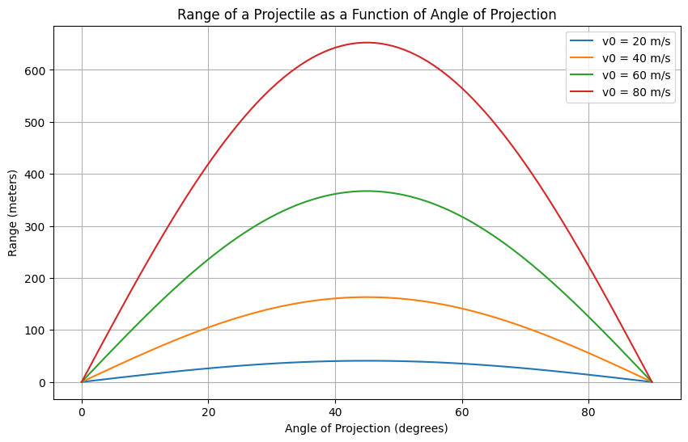

# Problem 1
# Task 1: Theoretical Foundation

## 1.1 Equations of Motion for Projectile Motion

The governing equations of motion for a projectile are derived from the basic principles of physics: **Newton's Laws of Motion** and the **equations of constant acceleration**. We will assume there is no air resistance in this idealized scenario.

### Horizontal Motion:

$$
x(t) = v_0 \cdot \cos(\theta) \cdot t
$$

where:
- $x(t)$ is the horizontal position at time $t$,
- $v_0$ is the initial velocity,
- $\theta$ is the angle of projection,
- $t$ is the time.

### Vertical Motion:

$$
y(t) = v_0 \cdot \sin(\theta) \cdot t - \frac{1}{2} g t^2
$$

where:
- $y(t)$ is the vertical position at time $t$,
- $g$ is the acceleration due to gravity ($9.81 \, \text{m/s}^2$).

These two equations describe the horizontal and vertical positions of the projectile at any given time $t$.

---

## 1.2 Time of Flight

The time of flight is the total time the projectile remains in the air before it hits the ground. To find this, we set the vertical position equal to zero at the time of impact:

$$
y(t_f) = 0
$$

Substitute the vertical motion equation:

$$
v_0 \sin(\theta) \cdot t_f - \frac{1}{2} g t_f^2 = 0
$$

Factoring out $t_f$:

$$
t_f \left( v_0 \sin(\theta) - \frac{1}{2} g t_f \right) = 0
$$

Solving for $t_f$ (ignoring the trivial solution $t_f = 0$):

$$
t_f = \frac{2 v_0 \sin(\theta)}{g}
$$

Thus, the time of flight depends on the initial velocity $v_0$ and the angle of projection $\theta$.

---

## 1.3 Range of the Projectile

The range $R$ is the horizontal distance the projectile travels before hitting the ground. It is given by the horizontal motion equation at the time of flight $t_f$:

$$
R = x(t_f) = v_0 \cdot \cos(\theta) \cdot t_f
$$

Substitute the time of flight $t_f = \frac{2 v_0 \sin(\theta)}{g}$ into the equation for range:

$$
R = v_0 \cdot \cos(\theta) \cdot \frac{2 v_0 \sin(\theta)}{g}
$$

Simplifying:

$$
R = \frac{v_0^2 \sin(2\theta)}{g}
$$

This is the formula for the range of a projectile.

---

## 1.4 Family of Solutions Based on Initial Conditions

The range $R$ depends on two variables: the initial velocity $v_0$ and the angle of projection $\theta$.

- **Effect of Initial Velocity $v_0$**: 
  - A higher initial velocity increases the range.
  
- **Effect of Angle of Projection $\theta$**:
  - The range $R$ is a function of $\sin(2\theta)$. Therefore, the range will be maximized when $\theta = 45^\circ$, since $\sin(90^\circ) = 1$.

By varying the initial velocity or launch angle, we obtain a family of solutions describing the projectile's behavior.


# Task 2: Analysis of the Range

## Investigating the Dependence of Range on Angle of Projection

The horizontal range $R$ of a projectile launched with an initial velocity $v_0$ at an angle $\theta$ is given by the standard kinematic equation:

$$
R = \frac{v_0^2 \sin(2\theta)}{g}
$$

where:
- $v_0$ is the initial velocity,
- $\theta$ is the angle of projection,
- $g$ is the acceleration due to gravity.

### Key Observations:
1. **Effect of Angle ($\theta$):**
   - The range is maximized when $\sin(2\theta) = 1$, which occurs at $\theta = 45^\circ$.
   - For angles greater or smaller than $45^\circ$, the range decreases symmetrically.

2. **Effect of Initial Velocity ($v_0$):**
   - Since $R \propto v_0^2$, doubling the initial velocity results in a fourfold increase in range.

3. **Effect of Gravitational Acceleration ($g$):**
   - The range is inversely proportional to $g$, meaning a lower gravitational field (such as on the Moon) results in a longer range, while a higher gravitational field (such as on Jupiter) results in a shorter range.

## Influence of Other Parameters

- **Air Resistance:** The idealized equation assumes no air resistance. In reality, drag reduces the range, and the optimal angle shifts slightly below $45^\circ$.
- **Altitude Variations:** Changes in $g$ due to altitude can affect the range.
- **Wind Effects:** A tailwind increases range, while a headwind decreases it.


# Task 3 : Practical Applications of Projectile Motion

## Adapting the Model for Real-World Scenarios

The idealized model of projectile motion assumes uniform gravitational acceleration, no air resistance, and a flat launch and landing surface. However, real-world scenarios often involve additional complexities. Below are some practical applications and modifications of the model:

### 1. Projectiles on Uneven Terrain
- In mountainous or hilly regions, the launch and landing points may be at different elevations.
- The range equation must be modified to account for varying heights using the kinematic equation:

  $$
  y = v_0 \sin(\theta) t - \frac{1}{2} g t^2
  $$

  where $y$ represents the vertical displacement.
- Adjustments are made by solving for the total flight time considering different initial and final heights.

### 2. Air Resistance and Drag Effects
- In practical cases, air resistance significantly affects projectile motion, reducing the range.
- The motion can be modeled using drag force $F_d$:

  $$
  F_d = \frac{1}{2} C_d \rho A v^2
  $$

  where:
  - $C_d$ is the drag coefficient,
  - $\rho$ is air density,
  - $A$ is the cross-sectional area,
  - $v$ is the velocity.
- Numerical simulations are used to approximate projectile trajectories under these conditions.

### 3. Sports and Ballistics Applications
- **Sports (Football, Basketball, Golf, etc.):** Air resistance and spin play crucial roles. The Magnus effect explains curving trajectories due to spin.
- **Military and Space Applications:** Artillery and missile trajectories account for drag, wind, and Coriolis force due to Earth's rotation.
- **Rocket Launches:** Rockets experience varying gravitational fields and atmospheric densities, requiring advanced modeling.


# Task 4 : Implementation
```python
import numpy as np
import matplotlib.pyplot as plt

# Constants
g = 9.81  # Acceleration due to gravity (m/s^2)

# Function to calculate the range of a projectile
def calculate_range(angle_deg, v0, g):
    angle_rad = np.radians(angle_deg)  # Convert angle to radians
    return (v0**2 * np.sin(2 * angle_rad)) / g

# Function to simulate and plot range vs angle for different initial velocities
def simulate_projectile_motion(initial_velocities):
    angles = np.linspace(0, 90, 100)  # Angles from 0° to 90°
    
    plt.figure(figsize=(10, 6))
    
    for v0 in initial_velocities:
        ranges = [calculate_range(angle, v0, g) for angle in angles]
        plt.plot(angles, ranges, label=f"v0 = {v0} m/s")
    
    plt.title("Range of a Projectile as a Function of Angle of Projection")
    plt.xlabel("Angle of Projection (degrees)")
    plt.ylabel("Range (meters)")
    plt.grid(True)
    plt.legend()
    plt.show()

# Initial velocities to test
initial_velocities = [20, 40, 60, 80]  # Different initial velocities (m/s)
```


