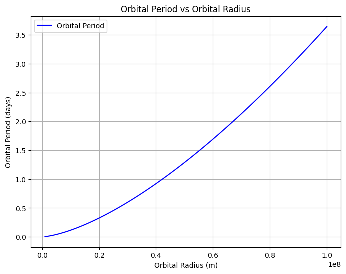

# Problem 1
# Task 1 : Derivation of Kepler's Third Law for Circular Orbits

Kepler's Third Law states that the square of the orbital period $T$ is proportional to the cube of the orbital radius $r$:

$$
T^2 \propto r^3
$$

In this section, we derive this relationship using Newton's laws of motion and the law of universal gravitation.

## 1. Centripetal Force and Gravitational Force

For a body in a **circular orbit** around a much larger mass (e.g., a planet orbiting a star), the **centripetal force** required to maintain the orbit is provided by the **gravitational force**:

### **Centripetal Force**
The centripetal force acting on a body of mass $m$ moving with velocity $v$ in a circular orbit of radius $r$ is:

$$
F_c = \frac{m v^2}{r}
$$

### **Gravitational Force**
The gravitational force exerted by a central mass $M$ (e.g., the Sun) on the orbiting body is given by Newton's Law of Gravitation:

$$
F_g = \frac{G M m}{r^2}
$$

where:
- $G$ is the universal gravitational constant,
- $M$ is the mass of the central body,
- $m$ is the mass of the orbiting body,
- $r$ is the orbital radius.

## 2. Equating Forces

Since gravity provides the necessary centripetal force, we set $F_c = F_g$:

$$
\frac{m v^2}{r} = \frac{G M m}{r^2}
$$

Canceling $m$ from both sides:

$$
\frac{v^2}{r} = \frac{G M}{r^2}
$$

Multiplying both sides by $r$:

$$
v^2 = \frac{G M}{r}
$$

## 3. Expressing Velocity in Terms of Orbital Period

The orbital velocity $v$ is related to the orbital period $T$ by:

$$
v = \frac{2\pi r}{T}
$$

Substituting this into the equation:

$$
\left(\frac{2\pi r}{T}\right)^2 = \frac{G M}{r}
$$

Expanding:

$$
\frac{4\pi^2 r^2}{T^2} = \frac{G M}{r}
$$

Multiplying both sides by $r$:

$$
4\pi^2 r^3 = G M T^2
$$

## 4. Final Form of Kepler's Third Law

Rearranging for $T^2$:

$$
T^2 = \frac{4\pi^2}{G M} r^3
$$

This shows that the square of the orbital period $T$ is **directly proportional** to the cube of the orbital radius $r$:

$$
T^2 \propto r^3
$$

This is Kepler's Third Law, which describes the relationship between the orbital period and the radius for objects in circular orbits around a massive central body.
---

# Task 2 : Discussion on the Implications of Kepler's Third Law for Astronomy

Kepler's Third Law, which relates the square of a planet's orbital period ($T$) to the cube of its orbital radius ($r$), has significant implications in the field of astronomy. This law helps astronomers determine various aspects of planetary systems, such as the masses of planets and the distances between celestial objects. 

## 1. **Calculating Planetary Masses**

Kepler's Third Law can be modified to help calculate the mass of a central body, such as a planet or star, based on the orbital characteristics of its satellite or orbiting object. The modified version of Kepler's Third Law is:

$$ T^2 = \frac{4 \pi^2 r^3}{G M} $$

Where:
- $T$ is the orbital period,
- $r$ is the orbital radius,
- $G$ is the gravitational constant, and
- $M$ is the mass of the central body.

From this equation, the mass of the central body ($M$) can be calculated as:

$$ M = \frac{4 \pi^2 r^3}{G T^2} $$

Thus, by knowing the orbital period and radius of an orbiting body (e.g., a moon or satellite), astronomers can calculate the mass of the planet or star it orbits.

## 2. **Determining Distances in Space**

Kepler’s Third Law also plays a crucial role in determining the distances between celestial bodies. By rearranging the law, astronomers can find the orbital radius of a planet, given the period of its orbit and the mass of the central body:

$$ r^3 = \frac{G M T^2}{4 \pi^2} $$

Knowing the orbital period ($T$) and the mass of the central body ($M$), the orbital radius ($r$) can be determined. This is particularly useful for calculating the distances between planets and their stars, or between moons and their planets.


# Task 3 : Real-World Examples of Kepler's Third Law: The Moon and Planetary Orbits

Kepler's Third Law, which describes the relationship between the orbital period and the orbital radius of a body, has real-world applications in understanding the motion of celestial bodies such as the Moon and the planets in the Solar System.

## 1. **The Moon's Orbit Around Earth**

The Moon orbits the Earth in an almost circular path, and its motion can be described using Kepler’s Third Law. The orbital period of the Moon is approximately 27.3 days, and its average orbital radius is about 384,400 km.

Using Kepler's Third Law, we can calculate the mass of the Earth based on the Moon's orbital period and radius. We know the gravitational constant ($G$) and the orbital period ($T$) of the Moon, so we can use the following formula:

$$ M = \frac{4 \pi^2 r^3}{G T^2} $$

Where:
- $r$ = 384,400 km (orbital radius of the Moon),
- $T$ = 27.3 days = 2,358,720 seconds (orbital period of the Moon),
- $G$ = $6.67430 \times 10^{-11}$ m$^3$ kg$^{-1}$ s$^{-2}$ (gravitational constant).

Plugging these values into the formula, we get the mass of the Earth. This calculation illustrates how Kepler's Third Law is used to determine the masses of celestial bodies.

## 2. **The Orbits of Planets in the Solar System**

Kepler's Third Law is also fundamental in understanding the orbits of planets around the Sun. For example, the orbital period of Earth is about 365.25 days, and the average distance from Earth to the Sun is about 149.6 million kilometers (1 AU). Using Kepler’s Third Law, we can compare the orbital characteristics of different planets in the Solar System.

For example, the orbital period of Jupiter is 11.86 Earth years, and its average distance from the Sun is about 778.3 million kilometers. If we use Kepler’s Third Law to compare the orbital periods and radii of Earth and Jupiter, we can predict the orbital behavior of these planets based on their distances from the Sun.

The formula for Kepler’s Third Law in this case is:

$$ \frac{T_1^2}{r_1^3} = \frac{T_2^2}{r_2^3} $$

Where:
- $T_1$ and $r_1$ are the orbital period and radius of Earth,
- $T_2$ and $r_2$ are the orbital period and radius of Jupiter.

By substituting the known values for Earth and Jupiter, we can verify that Kepler's Third Law holds true across the Solar System and makes it possible to compare the motion of planets.

# Task 4 : Implementing a Computational Model to Simulate Circular Orbits

In this task, we will implement a computational model to simulate circular orbits and verify the relationship between the orbital period and the orbital radius, as described by Kepler's Third Law. We will write a Python script to simulate the motion of a satellite orbiting a central body and calculate its orbital period based on its radius.

## 1. **Kepler's Third Law and Circular Orbits**

Kepler's Third Law states that:

$$ T^2 = \frac{4 \pi^2 r^3}{G M} $$

Where:
- $T$ is the orbital period,
- $r$ is the orbital radius,
- $G$ is the gravitational constant, and
- $M$ is the mass of the central body.

For circular orbits, we will simulate the motion of a satellite and calculate the orbital period for various orbital radii, using the above law. We can then compare the computed periods to the theoretical values to verify the relationship.

## 2. **Python Script to Simulate Circular Orbits**

Below is a Python script that simulates circular orbits for different orbital radii and calculates the orbital period based on Kepler's Third Law.

```python
import numpy as np
import matplotlib.pyplot as plt

# Constants
G = 6.67430e-11  # Gravitational constant (m^3 kg^-1 s^-2)
M = 5.972e24     # Mass of Earth (kg)
pi = np.pi

# Function to calculate orbital period using Kepler's Third Law
def orbital_period(r):
    T = 2 * pi * np.sqrt(r**3 / (G * M))  # Orbital period (seconds)
    return T

# Range of orbital radii (in meters)
radii = np.linspace(1e6, 1e8, 100)  # From 1,000 km to 100,000 km

# Calculate the orbital periods for each radius
periods = orbital_period(radii)

# Convert orbital period from seconds to days
periods_days = periods / (60 * 60 * 24)

# Plot the relationship between orbital period and orbital radius
plt.figure(figsize=(8, 6))
plt.plot(radii, periods_days, label='Orbital Period', color='b')
plt.xlabel('Orbital Radius (m)')
plt.ylabel('Orbital Period (days)')
plt.title('Orbital Period vs Orbital Radius')
plt.grid(True)
plt.legend()
plt.show()
