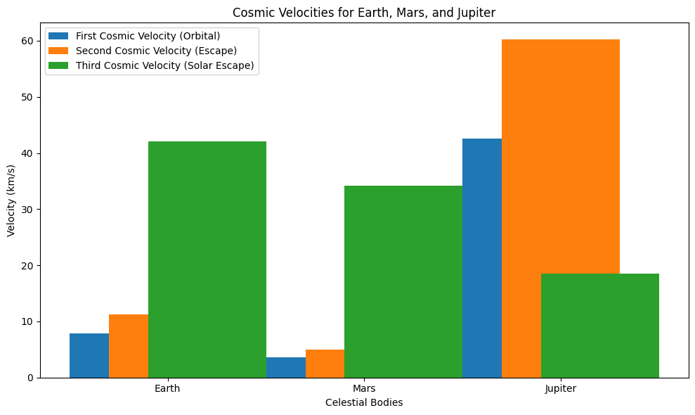

# Problem 2
# Task 1 : Defining the First, Second, and Third Cosmic Velocities

The concept of cosmic velocities refers to the minimum speeds needed for an object to achieve certain objectives in space: orbiting a celestial body, escaping its gravitational influence, and leaving a star system. These velocities are fundamental for space exploration and understanding how spacecraft interact with gravitational fields.

## 1. **First Cosmic Velocity: Orbital Velocity**

The first cosmic velocity is the minimum velocity an object must have to enter a stable orbit around a celestial body. This velocity ensures that the object moves fast enough such that its trajectory bends in a circle, counteracting the pull of gravity. 

The first cosmic velocity $v_1$ can be calculated using the formula:

$$ v_1 = \sqrt{\frac{GM}{r}} $$

Where:
- $G$ is the gravitational constant ($6.67430 \times 10^{-11}$ m$^3$ kg$^{-1}$ s$^{-2}$),
- $M$ is the mass of the celestial body (e.g., Earth, the Moon),
- $r$ is the distance from the center of the celestial body to the object (orbital radius).

This velocity represents the speed required to stay in a circular orbit without falling back to the surface of the celestial body.

## 2. **Second Cosmic Velocity: Escape Velocity**

The second cosmic velocity is the speed needed for an object to escape the gravitational influence of a celestial body without any further propulsion. This is the minimum velocity required to overcome the gravitational potential energy of the body and reach an infinite distance from it.

The second cosmic velocity $v_2$ is given by:

$$ v_2 = \sqrt{\frac{2GM}{r}} $$

Where:
- $G$ is the gravitational constant,
- $M$ is the mass of the celestial body,
- $r$ is the distance from the center of the celestial body to the object.

This velocity is exactly $\sqrt{2}$ times the orbital velocity, and it's required for an object to break free from the celestial body's gravitational pull.

## 3. **Third Cosmic Velocity: Solar Escape Velocity**

The third cosmic velocity is the speed needed to escape the gravitational pull of the Sun (or any star) and leave the solar system. This is the velocity at which an object must travel to escape the gravitational influence of the entire star system.

The third cosmic velocity $v_3$ is calculated using the formula:

$$ v_3 = \sqrt{\frac{2GM_{\text{sun}}}{r_{\text{sun}}}} $$

Where:
- $G$ is the gravitational constant,
- $M_{\text{sun}}$ is the mass of the Sun,
- $r_{\text{sun}}$ is the distance from the object to the Sun.

In practical terms, the third cosmic velocity is extremely high and typically requires interplanetary travel technology to achieve, often involving multiple stages of propulsion.


# Task 2 : Analyzing the Mathematical Derivations and Parameters Affecting the Cosmic Velocities

In this section, we will analyze the mathematical derivations of the first, second, and third cosmic velocities and explore the parameters that influence these velocities. Understanding these factors is essential for space exploration, as they determine the required energy for orbiting, escaping gravitational pulls, and interstellar travel.

## 1. **Derivation of the First Cosmic Velocity (Orbital Velocity)**

The first cosmic velocity is derived from the balance between the gravitational force and the centripetal force acting on an object in circular motion. The gravitational force between an object and a celestial body is given by:

$$ F_{\text{gravity}} = \frac{GMm}{r^2} $$

Where:
- $G$ is the gravitational constant,
- $M$ is the mass of the celestial body,
- $m$ is the mass of the orbiting object,
- $r$ is the distance between the object and the center of the celestial body.

For an object to be in a stable orbit, the gravitational force must equal the centripetal force, which is given by:

$$ F_{\text{centripetal}} = \frac{mv^2}{r} $$

Where:
- $v$ is the velocity of the orbiting object.

Setting the gravitational force equal to the centripetal force:

$$ \frac{GMm}{r^2} = \frac{mv^2}{r} $$

Simplifying and solving for $v$, we obtain the first cosmic velocity:

$$ v_1 = \sqrt{\frac{GM}{r}} $$

Thus, the first cosmic velocity depends on the mass of the central body and the distance from the center of the celestial body. A higher mass or a smaller radius results in a higher orbital velocity.

## 2. **Derivation of the Second Cosmic Velocity (Escape Velocity)**

The second cosmic velocity is the speed required to overcome the gravitational pull of a celestial body and escape its gravitational influence. This velocity is derived from the conservation of energy, specifically the total mechanical energy (kinetic + potential) of the object.

The total mechanical energy of an object of mass $m$ in the gravitational field of a celestial body of mass $M$ at a distance $r$ is the sum of its kinetic energy and gravitational potential energy:

- Kinetic energy: $$ K.E. = \frac{1}{2}mv^2 $$
- Gravitational potential energy: $$ U = -\frac{GMm}{r} $$

To escape the gravitational pull, the total mechanical energy of the object must be zero (the object must have enough kinetic energy to overcome the negative potential energy):

$$ \frac{1}{2}mv^2 - \frac{GMm}{r} = 0 $$

Solving for $v$, we obtain the second cosmic velocity:

$$ v_2 = \sqrt{\frac{2GM}{r}} $$

Thus, the second cosmic velocity is higher than the first cosmic velocity by a factor of $\sqrt{2}$. It depends on the mass of the central body and the distance from the center of the body, similar to the first cosmic velocity, but with a larger factor to overcome the gravitational potential energy.

## 3. **Derivation of the Third Cosmic Velocity (Solar Escape Velocity)**

The third cosmic velocity is the velocity required to escape the gravitational influence of the entire star system (e.g., the Solar System). It is derived from the same principle as the second cosmic velocity, but instead of escaping from a planet, the object must overcome the gravitational influence of the Sun.

The total mechanical energy for an object at distance $r$ from the Sun is:

- Kinetic energy: $$ K.E. = \frac{1}{2}mv^2 $$
- Gravitational potential energy: $$ U = -\frac{GM_{\text{sun}}m}{r} $$

For the object to escape the Sun's gravitational pull, the total mechanical energy must again be zero:

$$ \frac{1}{2}mv^2 - \frac{GM_{\text{sun}}m}{r} = 0 $$

Solving for $v$, we obtain the third cosmic velocity:

$$ v_3 = \sqrt{\frac{2GM_{\text{sun}}}{r}} $$

Where:
- $M_{\text{sun}}$ is the mass of the Sun,
- $r$ is the distance from the object to the Sun.

The third cosmic velocity is essentially the escape velocity from the Sun, and like the second cosmic velocity, it depends on the gravitational constant, the mass of the Sun, and the distance from the Sun. This velocity is much higher than the second cosmic velocity, as it involves escaping the gravitational field of an entire star system.

## 4. **Parameters Affecting the Cosmic Velocities**

The key parameters that affect all three cosmic velocities are:

- **Mass of the Central Body ($M$):** A larger mass increases the gravitational pull, requiring a higher velocity to achieve orbit, escape, or leave the star system. The mass of the Sun ($M_{\text{sun}}$) heavily influences the third cosmic velocity.
  
- **Distance from the Central Body ($r$):** A smaller distance from the center of the celestial body increases the required velocity. This is evident in the fact that the velocities are inversely proportional to the square root of the distance ($r$) in the formulas.

- **Gravitational Constant ($G$):** The gravitational constant is a universal factor that determines the strength of gravitational interactions between bodies. Its value affects all cosmic velocities in the same way.


# Task 3 : Calculating and Visualizing Cosmic Velocities for Different Celestial Bodies

In this task, we will calculate and visualize the first, second, and third cosmic velocities for different celestial bodies such as Earth, Mars, and Jupiter. The calculations will help us understand how the mass and radius of different planets and moons affect the required velocities for orbiting, escaping, and leaving their gravitational influence.

## 1. **Cosmic Velocity Formulas**

The formulas for the first, second, and third cosmic velocities are as follows:

- **First Cosmic Velocity (Orbital Velocity):**
  
  $$ v_1 = \sqrt{\frac{GM}{r}} $$

- **Second Cosmic Velocity (Escape Velocity):**
  
  $$ v_2 = \sqrt{\frac{2GM}{r}} $$

- **Third Cosmic Velocity (Solar Escape Velocity):**
  
  $$ v_3 = \sqrt{\frac{2GM_{\text{sun}}}{r_{\text{sun}}}} $$

Where:
- $G$ is the gravitational constant ($6.67430 \times 10^{-11}$ m$^3$ kg$^{-1}$ s$^{-2}$),
- $M$ is the mass of the celestial body,
- $r$ is the radius of the celestial body,
- $M_{\text{sun}}$ is the mass of the Sun ($1.989 \times 10^{30}$ kg),
- $r_{\text{sun}}$ is the distance from the object to the Sun (in the case of escape velocity from the Sun).

## 2. **Python Script to Calculate and Visualize Cosmic Velocities**

The following Python script calculates and visualizes the first, second, and third cosmic velocities for Earth, Mars, and Jupiter.

```python
import numpy as np
import matplotlib.pyplot as plt

# Constants
G = 6.67430e-11  # Gravitational constant (m^3 kg^-1 s^-2)
M_sun = 1.989e30  # Mass of the Sun (kg)

# Data for Earth, Mars, and Jupiter
celestial_bodies = {
    "Earth": {"mass": 5.972e24, "radius": 6.371e6, "distance_to_sun": 1.496e11},  # Earth
    "Mars": {"mass": 0.64171e24, "radius": 3.396e6, "distance_to_sun": 2.279e11},  # Mars
    "Jupiter": {"mass": 1.898e27, "radius": 6.991e7, "distance_to_sun": 7.785e11}  # Jupiter
}

# Function to calculate the first cosmic velocity (orbital velocity)
def first_cosmic_velocity(mass, radius):
    return np.sqrt(G * mass / radius)

# Function to calculate the second cosmic velocity (escape velocity)
def second_cosmic_velocity(mass, radius):
    return np.sqrt(2 * G * mass / radius)

# Function to calculate the third cosmic velocity (solar escape velocity)
def third_cosmic_velocity(distance_to_sun):
    return np.sqrt(2 * G * M_sun / distance_to_sun)

# Calculate the velocities for each celestial body
velocities = {}
for body, data in celestial_bodies.items():
    v1 = first_cosmic_velocity(data["mass"], data["radius"])  # First cosmic velocity
    v2 = second_cosmic_velocity(data["mass"], data["radius"])  # Second cosmic velocity
    v3 = third_cosmic_velocity(data["distance_to_sun"])  # Third cosmic velocity
    velocities[body] = {"v1": v1, "v2": v2, "v3": v3}

# Plot the velocities
labels = list(celestial_bodies.keys())
v1_values = [velocities[body]["v1"] / 1000 for body in labels]  # Convert m/s to km/s
v2_values = [velocities[body]["v2"] / 1000 for body in labels]  # Convert m/s to km/s
v3_values = [velocities[body]["v3"] / 1000 for body in labels]  # Convert m/s to km/s

# Plotting
x = np.arange(len(labels))

fig, ax = plt.subplots(figsize=(10, 6))

ax.bar(x - 0.2, v1_values, 0.6, label="First Cosmic Velocity (Orbital)")
ax.bar(x, v2_values, 0.6, label="Second Cosmic Velocity (Escape)")
ax.bar(x + 0.2, v3_values, 0.6, label="Third Cosmic Velocity (Solar Escape)")

ax.set_xlabel('Celestial Bodies')
ax.set_ylabel('Velocity (km/s)')
ax.set_title('Cosmic Velocities for Earth, Mars, and Jupiter')
ax.set_xticks(x)
ax.set_xticklabels(labels)
ax.legend()

plt.tight_layout()
plt.show()


