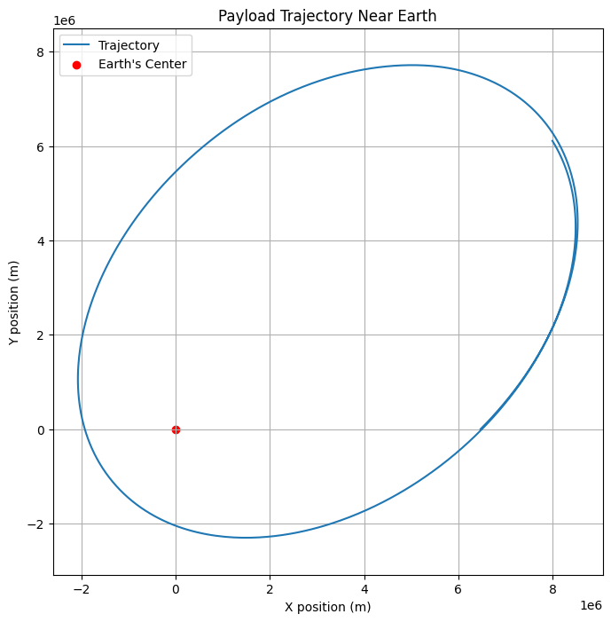
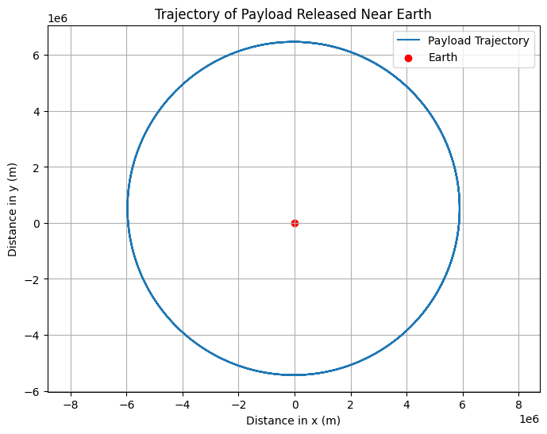

# Problem 3
# Task 1 : Analyzing the Possible Trajectories of a Payload Released Near Earth

When an object is released from a moving rocket near Earth, its trajectory depends on the object's initial conditions (such as velocity and position) and the gravitational forces acting on it. Understanding the possible trajectories is essential for planning space missions, such as deploying payloads or returning objects to Earth. The possible trajectories of the object include parabolic, hyperbolic, and elliptical paths, all governed by the principles of orbital mechanics and gravitational forces.

## 1. **Kepler's Laws and Newton's Law of Gravitation**

The motion of objects near Earth is primarily governed by the following principles:

- **Newton's Law of Gravitation** states that the force of gravity between two objects is proportional to the product of their masses and inversely proportional to the square of the distance between them:
  
  $$ F = \frac{G M m}{r^2} $$

  Where:
  - $F$ is the gravitational force,
  - $G$ is the gravitational constant ($6.67430 \times 10^{-11} \, \text{m}^3 \, \text{kg}^{-1} \, \text{s}^{-2}$),
  - $M$ is the mass of the Earth,
  - $m$ is the mass of the object,
  - $r$ is the distance between the center of the Earth and the object.

- **Kepler's Laws of Planetary Motion** describe the orbits of planets around the Sun. For objects near Earth, these laws can be applied to predict the trajectory, which can take various forms:
  - **Elliptical Orbits:** These are closed orbits where the object moves in an ellipse around the Earth.
  - **Parabolic Trajectories:** The object follows a path shaped like a parabola and will eventually escape Earth's gravitational pull if its speed is greater than the first cosmic velocity.
  - **Hyperbolic Trajectories:** The object follows a hyperbolic trajectory if its speed is greater than the second cosmic velocity, meaning it will escape Earth's gravity and travel away indefinitely.

## 2. **Types of Trajectories**

### 2.1. **Elliptical Trajectory**
An elliptical trajectory occurs when the object has less than the escape velocity but more than the orbital velocity (first cosmic velocity). The object will move in an elliptical orbit around Earth, eventually returning to its starting position unless disturbed by other forces.

The equation for an elliptical orbit is given by the vis-viva equation:

$$ v = \sqrt{GM \left( \frac{2}{r} - \frac{1}{a} \right)} $$

Where:
- $v$ is the velocity of the object,
- $G$ is the gravitational constant,
- $M$ is the mass of the Earth,
- $r$ is the distance from the center of the Earth to the object,
- $a$ is the semi-major axis of the ellipse.

### 2.2. **Parabolic Trajectory**
A parabolic trajectory occurs when the object's velocity is exactly equal to the escape velocity at a given distance from Earth. In this case, the object will travel on a path shaped like a parabola, eventually escaping Earth's gravity but not returning.

The escape velocity is given by:

$$ v_{\text{escape}} = \sqrt{\frac{2GM}{r}} $$

Where:
- $v_{\text{escape}}$ is the escape velocity,
- $G$ is the gravitational constant,
- $M$ is the mass of the Earth,
- $r$ is the distance from the center of Earth to the object.

### 2.3. **Hyperbolic Trajectory**
A hyperbolic trajectory occurs when the object's velocity is greater than the escape velocity. This trajectory is open and non-periodic, meaning the object will escape Earth's gravity and move away indefinitely, never returning.

The equation for a hyperbolic trajectory is similar to that of an elliptical trajectory but with higher velocities and larger energy:

$$ v = \sqrt{GM \left( \frac{2}{r} - \frac{1}{b} \right)} $$

Where:
- $v$ is the velocity of the object,
- $r$ is the distance from the center of Earth,
- $b$ is the distance of closest approach (a parameter describing the trajectory).

## 3. **Summary of Trajectories**

- **Elliptical Orbit**: Occurs when the object's velocity is between the orbital and escape velocities. The object will remain in orbit around Earth.
- **Parabolic Trajectory**: Occurs when the object's velocity is equal to the escape velocity. The object will escape Earth's gravity but will not return.
- **Hyperbolic Trajectory**: Occurs when the object's velocity exceeds the escape velocity. The object will escape Earth's gravitational influence and travel away indefinitely.

## 4. **Real-World Applications**

- **Satellite Deployment**: Satellites are typically launched into elliptical orbits. The initial velocity of the payload determines whether it will enter a stable orbit or escape Earth's gravity entirely.
- **Space Probes**: Space probes, like those sent to other planets, often follow parabolic or hyperbolic trajectories. They are given enough velocity to escape Earth's gravity and head toward their target destination, such as Mars or Jupiter.
- **Payloads Returning to Earth**: If a payload needs to return to Earth, its trajectory must be carefully controlled to ensure it follows a parabolic or elliptical path, eventually re-entering the atmosphere.

# Task 2 : Numerical Analysis of Payload Trajectory Based on Initial Conditions

In this task, we will perform a numerical analysis to compute the path of a payload released near Earth, given initial conditions such as position, velocity, and altitude. Using numerical methods like Euler’s method or the Runge-Kutta method, we can simulate the motion of the payload under the influence of Earth's gravity. This simulation will allow us to visualize the trajectory based on different initial conditions.

## 1. **Gravitational Forces and Equations of Motion**

The motion of the payload is governed by Newton's Law of Gravitation and the following equations:

- **Gravitational Force:** 
  $$ F = \frac{G M m}{r^2} $$

  Where:
  - $F$ is the gravitational force,
  - $G$ is the gravitational constant,
  - $M$ is the mass of the Earth,
  - $m$ is the mass of the object,
  - $r$ is the distance between the center of the Earth and the object.

- **Acceleration due to Gravity:**
  $$ a = \frac{F}{m} = \frac{G M}{r^2} $$

  Using the above force, we can calculate the acceleration at each point in the trajectory.

- **Equations of Motion:**
  Using the second law of motion ($F = ma$), we can determine the acceleration of the payload in both the radial and tangential directions:

  $$ \ddot{r} = - \frac{GM}{r^2} $$

  Where:
  - $\ddot{r}$ is the radial acceleration of the payload.

In our simulation, we will numerically solve the equations of motion using a simple numerical integration technique (Euler’s method) or a more accurate method (Runge-Kutta) to compute the position and velocity at each time step.

## 2. **Python Script for Numerical Simulation**

The following Python code uses Euler's method to simulate the trajectory of the payload based on initial conditions (position, velocity, and altitude). We will track the position and velocity at each time step and visualize the trajectory.

```python
import numpy as np
import matplotlib.pyplot as plt

# Constants
G = 6.67430e-11  # Gravitational constant (m^3 kg^-1 s^-2)
M = 5.972e24     # Mass of Earth (kg)
R = 6371e3       # Radius of Earth (m)

# Initial conditions: position, velocity, and altitude
initial_position = np.array([0, R + 100e3])  # Initial position: 100 km above Earth
initial_velocity = np.array([0, 7500])      # Initial velocity: 7.5 km/s tangential (typical orbital velocity)

# Time settings
dt = 10          # Time step (seconds)
total_time = 20000  # Total simulation time (seconds)
steps = int(total_time / dt)

# Arrays to store position and velocity over time
position = np.zeros((steps, 2))
velocity = np.zeros((steps, 2))
position[0] = initial_position
velocity[0] = initial_velocity

# Numerical simulation using Euler's method
for i in range(1, steps):
    r = np.linalg.norm(position[i-1])  # Distance from the center of Earth
    a = -G * M / r**2  # Radial acceleration (m/s^2)
    direction = position[i-1] / r  # Unit vector in the direction of the position
    
    # Update velocity and position using Euler's method
    velocity[i] = velocity[i-1] + np.array([a * direction[0], a * direction[1]]) * dt
    position[i] = position[i-1] + velocity[i] * dt

# Extract x and y positions for plotting
x_position = position[:, 0]
y_position = position[:, 1]

# Plot the trajectory of the payload
plt.figure(figsize=(8, 6))
plt.plot(x_position, y_position, label='Payload Trajectory')
plt.scatter(0, 0, color='red', label='Earth')  # Earth at the center
plt.title('Trajectory of Payload Released Near Earth')
plt.xlabel('Distance in x (m)')
plt.ylabel('Distance in y (m)')
plt.legend()
plt.grid(True)
plt.axis('equal')
plt.show()


# Task 3 : Relating Trajectories to Orbital Insertion, Reentry, and Escape Scenarios

The trajectory of a payload released near Earth can follow various paths, including elliptical, parabolic, or hyperbolic trajectories, depending on its initial conditions. These different trajectories play a crucial role in the success of space missions, influencing processes such as orbital insertion, reentry, and escape. Understanding how these trajectories relate to these scenarios is essential for mission planning, satellite deployment, and space exploration.

## 1. **Orbital Insertion**

Orbital insertion refers to the process of placing a spacecraft into a stable orbit around Earth or another celestial body. Achieving the correct trajectory for orbital insertion requires precise control of the spacecraft's speed and direction, as it must enter an elliptical orbit around the Earth.

### 1.1. **Elliptical Trajectories and Orbital Insertion**

- **Elliptical Trajectory:** This is the typical path followed by spacecraft after successful orbital insertion. An elliptical orbit allows a spacecraft to stay in orbit around Earth, following a path where the object alternates between being closer and farther from the Earth. 
- **Initial Velocity and Altitude:** The velocity and altitude of the spacecraft at the moment of insertion determine the shape and size of the orbit. If the spacecraft is launched with the right speed and angle, it will follow an elliptical path and remain in orbit.
- **Example:** Satellites in low Earth orbit (LEO) or geostationary orbit (GEO) follow elliptical orbits. The spacecraft may undergo a series of engine burns (orbital maneuvers) to adjust the orbit and circularize the path.

### 1.2. **Key Points in Orbital Insertion:**
- The spacecraft’s velocity must be carefully controlled to avoid falling back to Earth or escaping into space.
- The spacecraft must reach a sufficient speed to counteract the pull of gravity, avoiding atmospheric drag in the case of lower orbits.

## 2. **Reentry**

Reentry is the process by which a spacecraft returns to Earth’s atmosphere after completing its mission. This phase is particularly challenging due to the high velocities involved and the friction from the atmosphere, which generates extreme heat. Reentry occurs when a spacecraft follows a trajectory that brings it back to Earth from its orbital path.

### 2.1. **Elliptical Trajectories and Reentry**

- **Elliptical Trajectory:** If the spacecraft is in an elliptical orbit, its path may eventually intersect with the Earth's atmosphere. In this case, the spacecraft will experience reentry, which requires a controlled descent to ensure safe landing or recovery.
- **Deorbiting Maneuvers:** A spacecraft in orbit can perform a deorbit burn, which reduces its velocity and changes its orbit from elliptical to a trajectory that leads back to Earth. The spacecraft will enter a steep descent into the atmosphere.
- **Example:** The Space Shuttle's reentry was carefully planned to ensure that it followed a controlled elliptical trajectory that allowed for a safe descent and landing.

### 2.2. **Key Points in Reentry:**
- Reentry is a critical phase, requiring heat shields and precise control to avoid burning up due to atmospheric friction.
- The spacecraft’s trajectory must be accurately calculated to ensure it reenters the atmosphere at the right angle and speed.

## 3. **Escape Scenarios**

Escape scenarios occur when a spacecraft is launched with enough velocity to overcome Earth's gravitational pull and travel into space. The spacecraft can follow a parabolic or hyperbolic trajectory depending on its velocity.

### 3.1. **Parabolic and Hyperbolic Trajectories and Escape**

- **Parabolic Trajectory:** A parabolic trajectory occurs when the spacecraft's velocity is exactly equal to the escape velocity at a given point. This trajectory represents the minimum speed required for an object to escape Earth’s gravity. The spacecraft will move along a parabolic path, leaving Earth’s influence but never returning.
- **Hyperbolic Trajectory:** A hyperbolic trajectory occurs when the spacecraft’s velocity exceeds the escape velocity. The spacecraft will escape Earth’s gravitational pull and follow a hyperbolic path, traveling far from Earth and never returning.
  
  $$ v_{\text{escape}} = \sqrt{\frac{2GM}{r}} $$

  Where $v_{\text{escape}}$ is the escape velocity and $r$ is the distance from the center of the Earth.

- **Example:** Space probes, such as those sent to Mars or the outer planets, follow parabolic or hyperbolic trajectories. They are launched with sufficient velocity to escape Earth’s gravity and travel to their target destinations. Similarly, the Apollo missions followed a hyperbolic trajectory to escape Earth's gravitational influence and travel to the Moon.

### 3.2. **Key Points in Escape Scenarios:**
- The spacecraft must reach or exceed the escape velocity to break free from Earth's gravitational pull.
- Escape trajectories are typically used in interplanetary missions, where spacecraft need to travel to other planets, moons, or even other star systems.

## 4. **Real-World Applications and Mission Planning**

Understanding how the different types of trajectories relate to orbital insertion, reentry, and escape is crucial for successful space mission planning. Some real-world applications include:

### 4.1. **Satellite Launches**
- Satellites are typically inserted into elliptical orbits around Earth. The launch vehicle must achieve the correct velocity and altitude to ensure the satellite reaches the desired orbit. Satellites in geostationary orbit, for example, are placed in nearly circular orbits 35,786 km above the equator.

### 4.2. **Space Probes and Interplanetary Missions**
- Space probes, like the Mars rovers or Voyager probes, are launched with sufficient velocity to follow parabolic or hyperbolic trajectories, escaping Earth's gravity to reach other planets, moons, or even stars.

### 4.3. **Spacecraft Reentry and Recovery**
- Spacecraft like the Space Shuttle or modern crewed capsules (e.g., SpaceX's Dragon) need to follow controlled reentry trajectories to return safely to Earth. A controlled deorbit burn ensures that the spacecraft follows an elliptical trajectory that intersects the Earth's atmosphere for safe reentry.

# Task 4 : Computational Tool to Simulate and Visualize Payload Motion Under Earth's Gravity

In this task, we will develop a Python tool to simulate and visualize the motion of a payload under Earth's gravity. The motion will be computed based on the initial conditions, including position, velocity, and direction. We will use numerical methods to model the gravitational force and integrate the equations of motion to calculate the trajectory of the payload over time.

## 1. **Problem Overview**

When a payload is released from a moving rocket near Earth, its motion is influenced by gravitational forces. To simulate the motion, we need to calculate:
- The acceleration due to gravity at each point.
- The velocity and position of the payload at each time step.
- The trajectory of the payload, based on different initial velocities and directions.

## 2. **Equations of Motion**

The motion of the payload is governed by Newton's Law of Gravitation and the second law of motion. The gravitational force $F$ acting on the payload is given by:

$$ F = \frac{G M m}{r^2} $$

Where:
- $G$ is the gravitational constant,
- $M$ is the mass of Earth,
- $m$ is the mass of the payload,
- $r$ is the distance between the payload and the center of the Earth.

The acceleration due to gravity is:

$$ a = \frac{F}{m} = \frac{G M}{r^2} $$

The position and velocity of the payload at any given time can be updated using numerical integration methods (Euler's method or Runge-Kutta method). In this example, we will use Euler’s method for simplicity.

## 3. **Python Script for Simulation**

The following Python code simulates the motion of a payload under Earth’s gravity using Euler's method to numerically solve the equations of motion.

### 3.1 **Code Implementation**

```python
import numpy as np
import matplotlib.pyplot as plt

# Constants
G = 6.67430e-11  # Gravitational constant (m^3 kg^-1 s^-2)
M = 5.972e24     # Mass of Earth (kg)
R = 6371e3       # Radius of Earth (m)

# Initial conditions: position, velocity, and direction
initial_position = np.array([0, R + 100e3])  # Initial position: 100 km above Earth
initial_velocity = np.array([7500, 0])      # Initial velocity: 7.5 km/s tangential (typical orbital velocity)

# Time settings
dt = 10          # Time step (seconds)
total_time = 20000  # Total simulation time (seconds)
steps = int(total_time / dt)

# Arrays to store position and velocity over time
position = np.zeros((steps, 2))
velocity = np.zeros((steps, 2))
position[0] = initial_position
velocity[0] = initial_velocity

# Numerical simulation using Euler's method
for i in range(1, steps):
    r = np.linalg.norm(position[i-1])  # Distance from the center of Earth
    a = -G * M / r**2  # Radial acceleration (m/s^2)
    direction = position[i-1] / r  # Unit vector in the direction of the position
    
    # Update velocity and position using Euler's method
    velocity[i] = velocity[i-1] + np.array([a * direction[0], a * direction[1]]) * dt
    position[i] = position[i-1] + velocity[i] * dt

# Extract x and y positions for plotting
x_position = position[:, 0]
y_position = position[:, 1]

# Plot the trajectory of the payload
plt.figure(figsize=(8, 6))
plt.plot(x_position, y_position, label='Payload Trajectory')
plt.scatter(0, 0, color='red', label='Earth')  # Earth at the center
plt.title('Trajectory of Payload Released Near Earth')
plt.xlabel('Distance in x (m)')
plt.ylabel('Distance in y (m)')
plt.legend()
plt.grid(True)
plt.axis('equal')
plt.show()

