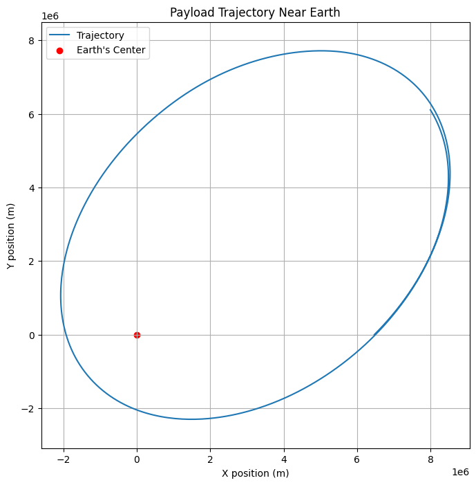

# problem 3
# Task 1: Analyze the Possible Trajectories of a Payload Released Near Earth

When a payload is released near Earth from a moving rocket, its trajectory depends on various factors, including the initial conditions of the rocket and the gravitational forces acting on the object. These trajectories can be categorized as:

- **Parabolic Trajectory**: The object follows a curved path due to the combination of its initial velocity and the gravitational pull of the Earth. This trajectory occurs when the object’s speed is just below the escape velocity.
  
- **Hyperbolic Trajectory**: This trajectory occurs when the object’s speed is greater than the escape velocity, causing it to leave Earth’s gravitational influence.

- **Elliptical Trajectory**: If the object's speed is less than the escape velocity but greater than the velocity for a circular orbit, it will follow an elliptical trajectory around Earth, with Earth located at one of the foci of the ellipse.

## Mathematical Model

### Newton's Law of Gravitation
The force of gravity between two objects (e.g., Earth and the payload) is given by:

$$ F = \frac{GMm}{r^2} $$

Where:
- $F$ is the gravitational force,
- $G$ is the gravitational constant ($6.67430 \times 10^{-11} \, \text{m}^3 \, \text{kg}^{-1} \, \text{s}^{-2}$),
- $M$ is the mass of Earth ($5.972 \times 10^{24} \, \text{kg}$),
- $m$ is the mass of the payload,
- $r$ is the distance between the centers of the two masses.

### Orbital Mechanics

We can describe the motion of an object near Earth using the **vis-viva equation**, which provides the speed of an object in orbit at a given distance from the center of the Earth:

$$ v(r) = \sqrt{GM\left(\frac{2}{r} - \frac{1}{a}\right)} $$

Where:
- $v(r)$ is the velocity of the object at distance $r$,
- $G$ is the gravitational constant,
- $M$ is the mass of Earth,
- $a$ is the semi-major axis of the orbit (the average of the periapsis and apoapsis distances).

For each type of trajectory, the value of the semi-major axis $a$ and the velocity at a given distance will determine the path of the object.

### Types of Trajectories

1. **Parabolic Trajectory**: The total mechanical energy is zero, i.e., $E = 0$.
   $$ E = \frac{1}{2}mv^2 - \frac{GMm}{r} = 0 $$

2. **Hyperbolic Trajectory**: The total mechanical energy is positive, i.e., $E > 0$.
   $$ E = \frac{1}{2}mv^2 - \frac{GMm}{r} > 0 $$

3. **Elliptical Trajectory**: The total mechanical energy is negative, i.e., $E < 0$.
   $$ E = \frac{1}{2}mv^2 - \frac{GMm}{r} < 0 $$

## Numerical Simulation Approach

You can use numerical methods to simulate the payload’s motion and visualize the different types of trajectories. For example, using Python and libraries like `matplotlib` for visualization and `scipy.integrate` for solving the equations of motion.

# Task 2: Perform a Numerical Analysis to Compute the Path of the Payload

In this task, we will perform a numerical analysis to compute the path of the payload based on given initial conditions, including position, velocity, and altitude. The goal is to simulate the trajectory of the object under the influence of Earth's gravitational force.

## Assumptions and Initial Conditions
For the numerical analysis, we need to assume some initial conditions. These include:
- **Initial position**: The initial distance from the Earth's center (altitude + Earth's radius).
- **Initial velocity**: The initial speed and direction of the payload.
- **Altitude**: The height above the Earth's surface from which the payload is released.

We will also assume the Earth is a perfect sphere and the gravitational force is central and acts radially.

### Governing Equations
The equations governing the motion of the payload under gravitational attraction can be derived from Newton's second law and Newton's law of gravitation. The position vector $\vec{r}(t)$ evolves according to the following differential equations:

$$ \frac{d^2 \vec{r}}{dt^2} = -\frac{GM}{r^2} \hat{r} $$

Where:
- $G$ is the gravitational constant,
- $M$ is the mass of the Earth,
- $r$ is the radial distance from the center of the Earth,
- $\hat{r}$ is the unit vector in the direction of the position.

We will solve these equations numerically using methods like **Euler’s method** or **Runge-Kutta**.

### Numerical Solution Approach
We will discretize time into small steps and use numerical integration to calculate the position and velocity of the payload at each time step. We'll use Python and the `scipy.integrate` library to solve the system of equations.

### Python Code for Numerical Simulation
Below is a Python script that performs the numerical integration and simulates the trajectory of the payload.

```python
import numpy as np
import matplotlib.pyplot as plt
from scipy.integrate import solve_ivp

# Constants
G = 6.67430e-11  # Gravitational constant in m^3 kg^-1 s^-2
M = 5.972e24      # Mass of the Earth in kg
R_earth = 6371000 # Radius of the Earth in meters

# Initial conditions (example values)
altitude = 100000  # Altitude above Earth's surface in meters
initial_velocity = 7500  # Initial velocity in m/s (tangential)
theta = np.pi / 4  # Angle for the velocity (45 degrees)

# Initial position vector (radial distance from Earth's center)
r0 = R_earth + altitude

# Initial velocity components
vx0 = initial_velocity * np.cos(theta)
vy0 = initial_velocity * np.sin(theta)

# Initial state vector [x, y, vx, vy]
initial_state = [r0, 0, vx0, vy0]

# Gravitational force function
def gravitational_acceleration(t, state):
    x, y, vx, vy = state
    r = np.sqrt(x**2 + y**2)
    ax = -G * M * x / r**3
    ay = -G * M * y / r**3
    return [vx, vy, ax, ay]

# Time span for the simulation
t_span = (0, 6000)  # Time in seconds (e.g., 6000 seconds ~ 1.67 hours)

# Time points to evaluate the solution
t_eval = np.linspace(t_span[0], t_span[1], 1000)

# Solve the system of differential equations
solution = solve_ivp(gravitational_acceleration, t_span, initial_state, t_eval=t_eval)

# Extract the solution
x, y = solution.y[0], solution.y[1]

# Plot the trajectory
plt.figure(figsize=(8, 8))
plt.plot(x, y, label="Trajectory")
plt.scatter(0, 0, color='red', label="Earth's Center")
plt.title("Payload Trajectory Near Earth")
plt.xlabel("X position (m)")
plt.ylabel("Y position (m)")
plt.legend()
plt.axis('equal')
plt.grid(True)
plt.show()

