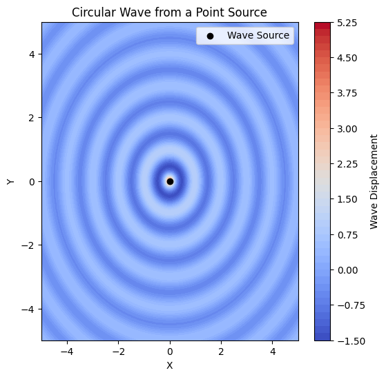

# **Task: Circular Wave Interference from a Point Source**

## **Wave Equation**
A circular wave on the water surface, emanating from a point source located at $ (x_0, y_0) $, can be described by:

$$
\eta(x, y, t) = \frac{A}{\sqrt{r}} \cdot \cos (kr - \omega t + \phi)
$$

where:

- $ \eta(x, y, t) $ = displacement of the water surface at point $ (x, y) $ and time $ t $.
- $ A $ = amplitude of the wave.
- $ k = \frac{2\pi}{\lambda} $ = wave number, related to the wavelength $ \lambda $.
- $ \omega = 2\pi f $ = angular frequency, related to the frequency $ f $.
- $ r = \sqrt{(x - x_0)^2 + (y - y_0)^2} $ = distance from the source to point $ (x, y) $.
- $ \phi $ = initial phase.

---

## **Wave Properties**
### **1. Relationship Between Wavelength, Frequency, and Speed**
The wave speed $ v $ is related to frequency and wavelength:

$$
v = f \lambda
$$

### **2. Wave Energy**
The energy of a wave is proportional to the square of the amplitude:

$$
E \propto A^2
$$

### **3. Superposition of Multiple Waves**
If multiple wave sources exist, the total displacement is given by:

$$
\eta_{\text{sum}}(x, y, t) = \sum_{i=1}^{N} \eta_i(x, y, t)
$$

where $ N $ is the number of sources.

---

## **Graphical Representation**

### **1. Circular Wave from a Single Source**
```python
import numpy as np
import matplotlib.pyplot as plt

# Define parameters
A = 1
lambda_ = 1
f = 1
omega = 2 * np.pi * f
k = 2 * np.pi / lambda_
x0, y0 = 0, 0
phi = 0

# Create grid
x = np.linspace(-5, 5, 200)
y = np.linspace(-5, 5, 200)
X, Y = np.meshgrid(x, y)

# Compute distance from source
R = np.sqrt((X - x0)**2 + (Y - y0)**2)

# Compute wave displacement at t=0
eta = (A / np.sqrt(R + 1e-6)) * np.cos(k * R + phi)

# Plot
plt.figure(figsize=(6, 6))
plt.contourf(X, Y, eta, levels=50, cmap='coolwarm')
plt.colorbar(label="Wave Displacement")
plt.scatter(x0, y0, color='black', marker='o', label="Wave Source")
plt.legend()
plt.xlabel("X")
plt.ylabel("Y")
plt.title("Circular Wave from a Point Source")
plt.show()
```
