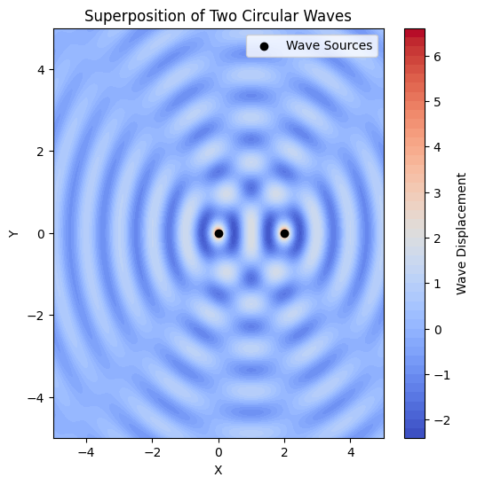
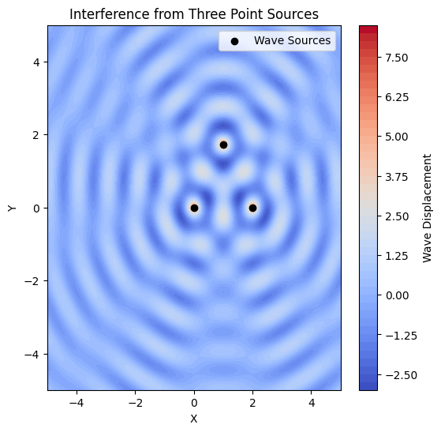

# **Task 1 : Circular Wave Interference from a Point Source**

## **Wave Equation**
A circular wave on the water surface, emanating from a point source located at $ (x_0, y_0) $, can be described by:

$$
\eta(x, y, t) = \frac{A}{\sqrt{r}} \cdot \cos (kr - \omega t + \phi)
$$

where:

- $ \eta(x, y, t) $ = displacement of the water surface at point $ (x, y) $ and time $ t $.
- $ A $ = amplitude of the wave.
- $ k = \frac{2\pi}{\lambda} $ = wave number, related to the wavelength $ \lambda $.
- $ \omega = 2\pi f $ = angular frequency, related to the frequency $ f $.
- $ r = \sqrt{(x - x_0)^2 + (y - y_0)^2} $ = distance from the source to point $ (x, y) $.
- $ \phi $ = initial phase.

---

## **Wave Properties**
### **1. Relationship Between Wavelength, Frequency, and Speed**
The wave speed $ v $ is related to frequency and wavelength:

$$
v = f \lambda
$$

### **2. Wave Energy**
The energy of a wave is proportional to the square of the amplitude:

$$
E \propto A^2
$$

### **3. Superposition of Multiple Waves**
If multiple wave sources exist, the total displacement is given by:

$$
\eta_{\text{sum}}(x, y, t) = \sum_{i=1}^{N} \eta_i(x, y, t)
$$

where $ N $ is the number of sources.

---

---

## **Deliverables**
1. **Mathematical Model**:
   - Formulate the equations describing the waves from multiple sources.
   - Apply the **principle of superposition** to determine total displacement.
   
2. **Graphical Representation**:
   - Generate **visual simulations** showing interference patterns.
   - Identify **constructive** and **destructive** interference regions.
   
3. **Code Implementation**:
   - A Python script (or Jupyter Notebook) implementing the simulation.
   - Well-commented code for clarity.

---

## **Wave Equation for a Single Source**
A circular wave on the water surface, emanating from a point source located at $(x_0, y_0)$, is described by:

$$
\eta(x, y, t) = \frac{A}{\sqrt{r}} \cdot \cos (kr - \omega t + \phi)
$$

where:
- $A$ = amplitude of the wave.
- $k = \frac{2\pi}{\lambda}$ = wave number.
- $\omega = 2\pi f$ = angular frequency.
- $r = \sqrt{(x - x_0)^2 + (y - y_0)^2}$ = distance from the source.
- $\phi$ = initial phase.
flkf;la
---

## **Superposition of Waves from Multiple Sources**
For a polygon with $N$ sources at coordinates $(x_i, y_i)$, the total wave displacement is:

$$
\eta_{\text{sum}}(x, y, t) = \sum_{i=1}^{N} \frac{A}{\sqrt{r_i}} \cos (k r_i - \omega t + \phi)
$$

where $r_i$ is the distance from the $i$th source.

---

---

### **. Wave Equations**
Each wave source at position $ (x_i, y_i) $ emits a wave described by:

$$
\eta_i(x, y, t) = \frac{A}{\sqrt{r_i}} \cos (k r_i - \omega t + \phi)
$$

where:
- $ A $ = wave amplitude.
- $ k = \frac{2\pi}{\lambda} $ = wave number.
- $ \omega = 2\pi f $ = angular frequency.
- $ r_i = \sqrt{(x - x_i)^2 + (y - y_i)^2} $ = distance from source $ i $ to point $ (x, y) $.
- $ \phi $ = initial phase.

---

### **. Superposition of Waves**
The total wave displacement at each point on the water surface is given by the **principle of superposition**:

$$
\eta_{\text{sum}}(x, y, t) = \sum_{i=1}^{N} \eta_i(x, y, t)
$$

where $ N $ is the number of wave sources (vertices of the polygon).

---

### **. Analyze Interference Patterns**
- Examine the resulting displacement $ \eta_{\text{sum}}(x, y, t) $ as a function of position $ (x, y) $ and time $ t $.
- Identify:
  - **Constructive Interference**: Regions where waves reinforce each other (higher amplitude).
  - **Destructive Interference**: Regions where waves cancel out (lower amplitude).

---

