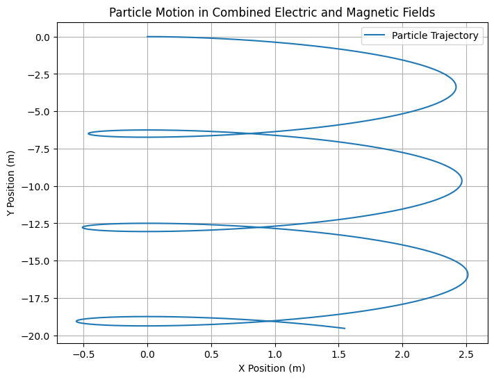
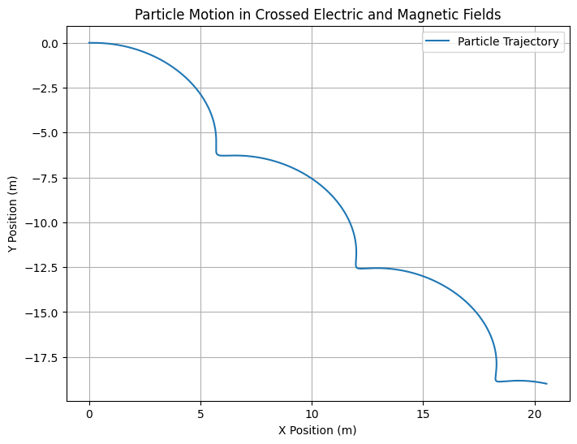
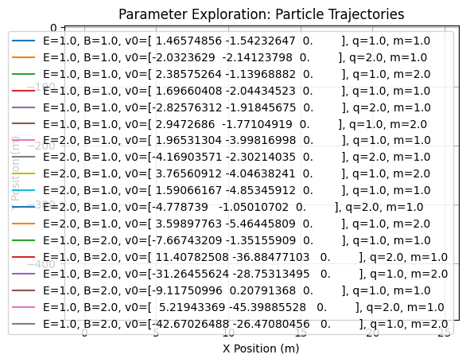

# Problem 1
# Lorentz Force and Related Formulas

### 1. Lorentz Force Formula:

The Lorentz force $\mathbf{F}$ experienced by a charged particle with charge $q$ moving with velocity $\mathbf{v}$ in the presence of electric $\mathbf{E}$ and magnetic $\mathbf{B}$ fields is given by:

$$
\mathbf{F} = q\mathbf{E} + q\mathbf{v} \times \mathbf{B}
$$

Where:
- $\mathbf{F}$ is the force on the particle,
- $q$ is the charge of the particle,
- $\mathbf{E}$ is the electric field,
- $\mathbf{v}$ is the velocity of the particle,
- $\mathbf{B}$ is the magnetic field.

### 2. Force on a Particle in a Magnetic Field:

The force on a charged particle moving perpendicular to a magnetic field is:

$$
F = qvB
$$

Where:
- $F$ is the force,
- $q$ is the charge,
- $v$ is the velocity of the particle,
- $B$ is the magnetic field strength.

This equation assumes that the velocity of the particle is perpendicular to the magnetic field.

### 3. Radius of Circular Motion in a Magnetic Field:

The radius $r$ of the circular motion of a particle with charge $q$ and mass $m$ in a uniform magnetic field $B$ is given by:

$$
r = \frac{mv}{qB}
$$

Where:
- $m$ is the mass of the particle,
- $v$ is the velocity of the particle,
- $q$ is the charge of the particle,
- $B$ is the magnetic field strength.

### 4. Cyclotron Frequency:

The frequency of a charged particle in circular motion in a magnetic field is called the cyclotron frequency and is given by:

$$
f = \frac{qB}{2\pi m}
$$

Where:
- $f$ is the frequency,
- $q$ is the charge of the particle,
- $B$ is the magnetic field strength,
- $m$ is the mass of the particle.

### 5. Kinetic Energy of a Charged Particle:

The kinetic energy $K$ of a particle with mass $m$ and velocity $v$ is given by:

$$
K = \frac{1}{2}mv^2
$$

This formula is important for calculating the energy of particles accelerated in systems like cyclotrons.

### 6. Lorentz Force in a Uniform Electric and Magnetic Field (Crossed Fields):

When both electric and magnetic fields are present, the motion of a charged particle can be described by the equation:

$$
\mathbf{F} = q(\mathbf{E} + \mathbf{v} \times \mathbf{B})
$$

In cases of crossed electric and magnetic fields, such as in a velocity selector, the forces from both fields can balance, leading to specific trajectories.

### 7. Drift Velocity in Plasma:

In a plasma under the influence of electric and magnetic fields, the drift velocity $\mathbf{v_d}$ of charged particles is given by:

$$
\mathbf{v_d} = \frac{\mathbf{E} \times \mathbf{B}}{B^2}
$$

Where:
- $\mathbf{v_d}$ is the drift velocity,
- $\mathbf{E}$ is the electric field,
- $\mathbf{B}$ is the magnetic field.

This drift velocity is crucial in understanding plasma behavior in magnetic confinement devices.

### 8. Motion of a Charged Particle in Both Electric and Magnetic Fields:

When both electric and magnetic fields are applied, the motion of the charged particle is described by the following second-order differential equation:

$$
\frac{d^2\mathbf{r}}{dt^2} = \frac{q}{m}(\mathbf{E} + \mathbf{v} \times \mathbf{B})
$$

Where:
- $\frac{d^2\mathbf{r}}{dt^2}$ is the acceleration of the particle,
- $q$ is the charge,
- $m$ is the mass,
- $\mathbf{E}$ and $\mathbf{B}$ are the electric and magnetic fields, respectively.

### Summary of Key Equations:

- Lorentz Force: $$ \mathbf{F} = q\mathbf{E} + q\mathbf{v} \times \mathbf{B} $$
- Magnetic Force: $$ F = qvB $$
- Radius of Circular Motion: $$ r = \frac{mv}{qB} $$
- Cyclotron Frequency: $$ f = \frac{qB}{2\pi m} $$
- Kinetic Energy: $$ K = \frac{1}{2}mv^2 $$
- Drift Velocity: $$ \mathbf{v_d} = \frac{\mathbf{E} \times \mathbf{B}}{B^2} $$

# Formulas for Simulating Particle Motion

### 1. Work Done by the Lorentz Force:

The work done by the Lorentz force $\mathbf{F}$ over a displacement $\mathbf{dr}$ is given by:

$$
dW = \mathbf{F} \cdot d\mathbf{r}
$$

Since the magnetic force is always perpendicular to the velocity, the work done by the magnetic field is zero:

$$
dW_{\text{magnetic}} = 0
$$

Only the electric field contributes to the work done on the particle.

### 2. Particle Motion in Both Electric and Magnetic Fields:

For a charged particle moving in the presence of both electric and magnetic fields, the equation of motion is:

$$
\frac{d^2\mathbf{r}}{dt^2} = \frac{q}{m}(\mathbf{E} + \mathbf{v} \times \mathbf{B})
$$

Where:
- $\frac{d^2\mathbf{r}}{dt^2}$ is the acceleration of the particle,
- $q$ is the charge of the particle,
- $m$ is the mass of the particle,
- $\mathbf{E}$ and $\mathbf{B}$ are the electric and magnetic fields, respectively.

### 3. Drift Velocity in Plasma:

In a plasma under crossed electric and magnetic fields, the drift velocity $\mathbf{v_d}$ is given by:

$$
\mathbf{v_d} = \frac{\mathbf{E} \times \mathbf{B}}{B^2}
$$

Where:
- $\mathbf{v_d}$ is the drift velocity,
- $\mathbf{E}$ is the electric field,
- $\mathbf{B}$ is the magnetic field.

### 4. Helical Motion of a Charged Particle:

When a charged particle moves in a combined electric and magnetic field, its trajectory is often helical. The helical motion can be described by two components:
1. **Circular Motion** due to the magnetic field: 
   $$ \mathbf{r}_\text{mag} = r \cos(\omega t) \hat{i} + r \sin(\omega t) \hat{j} $$
   where $\omega = \frac{qB}{m}$ is the angular frequency.

2. **Linear Motion** due to the electric field:
   $$ \mathbf{r}_\text{elec} = v_\parallel t \hat{k} $$

Where:
- $\mathbf{r}_\text{mag}$ is the circular motion component,
- $r$ is the radius of the circular path,
- $\omega$ is the angular frequency,
- $v_\parallel$ is the velocity component parallel to the electric field,
- $\hat{i}, \hat{j}, \hat{k}$ are unit vectors in the x, y, and z directions, respectively.

The total position of the particle is the sum of the circular and linear components:
$$
\mathbf{r}(t) = \mathbf{r}_\text{mag} + \mathbf{r}_\text{elec}
$$

### 5. Velocity Components in Helical Motion:

The velocity of the particle in helical motion can be decomposed into two components:
1. **Perpendicular velocity** to the magnetic field:
   $$ v_\perp = \frac{qB}{m} r $$

2. **Parallel velocity** along the direction of the electric field:
   $$ v_\parallel = \frac{E}{B} $$

Where:
- $v_\perp$ is the velocity perpendicular to the magnetic field (circular motion),
- $v_\parallel$ is the velocity parallel to the electric field (linear motion).

### 6. Magnetic Force in Non-Uniform Magnetic Field:

In a non-uniform magnetic field, the force on a charged particle is given by:

$$
\mathbf{F} = q(\mathbf{E} + \mathbf{v} \times \mathbf{B}) + q \left( \frac{d\mathbf{B}}{dt} \right)
$$

Where the additional term $\frac{d\mathbf{B}}{dt}$ accounts for the change in the magnetic field over time, which leads to more complex dynamics.

### Summary of Key Formulas:

- Work Done by Lorentz Force: $$ dW = \mathbf{F} \cdot d\mathbf{r} $$
- Equation of Motion in Electric and Magnetic Fields: $$ \frac{d^2\mathbf{r}}{dt^2} = \frac{q}{m}(\mathbf{E} + \mathbf{v} \times \mathbf{B}) $$
- Drift Velocity in Plasma: $$ \mathbf{v_d} = \frac{\mathbf{E} \times \mathbf{B}}{B^2} $$
- Helical Motion Components: $$ \mathbf{r}(t) = \mathbf{r}_\text{mag} + \mathbf{r}_\text{elec} $$

# Formulas for Parameter Exploration

### 1. Lorentz Force with Variable Parameters:

The general equation for the Lorentz force acting on a charged particle of charge $q$ and velocity $\mathbf{v}$ in the presence of electric $\mathbf{E}$ and magnetic $\mathbf{B}$ fields is:

$$
\mathbf{F} = q\mathbf{E} + q\mathbf{v} \times \mathbf{B}
$$

Where:
- $\mathbf{F}$ is the force,
- $q$ is the charge of the particle,
- $\mathbf{E}$ is the electric field,
- $\mathbf{B}$ is the magnetic field,
- $\mathbf{v}$ is the velocity of the particle.

### 2. Magnetic Force on a Charged Particle:

The force on a charged particle with charge $q$ moving in a magnetic field $\mathbf{B}$ is:

$$
\mathbf{F_B} = q\mathbf{v} \times \mathbf{B}
$$

Where:
- $\mathbf{F_B}$ is the magnetic force,
- $q$ is the charge of the particle,
- $\mathbf{v}$ is the velocity,
- $\mathbf{B}$ is the magnetic field.

### 3. Electric Force on a Charged Particle:

The force on a charged particle with charge $q$ in an electric field $\mathbf{E}$ is:

$$
\mathbf{F_E} = q\mathbf{E}
$$

Where:
- $\mathbf{F_E}$ is the electric force,
- $q$ is the charge of the particle,
- $\mathbf{E}$ is the electric field.

### 4. Radius of Circular Motion in a Magnetic Field:

The radius $r$ of the circular motion of a charged particle with charge $q$ and mass $m$ in a magnetic field $\mathbf{B}$ depends on the velocity $v$ of the particle:

$$
r = \frac{mv}{qB}
$$

Where:
- $r$ is the radius of the circular path,
- $m$ is the mass of the particle,
- $v$ is the velocity of the particle,
- $q$ is the charge of the particle,
- $B$ is the magnetic field strength.

### 5. Cyclotron Frequency with Charge and Mass Variations:

The cyclotron frequency $f$ depends on the charge $q$, mass $m$, and magnetic field $B$:

$$
f = \frac{qB}{2\pi m}
$$

Where:
- $f$ is the cyclotron frequency,
- $q$ is the charge of the particle,
- $B$ is the magnetic field strength,
- $m$ is the mass of the particle.

### 6. Velocity in Circular Motion:

The velocity $v$ of a particle moving in a circular path under the influence of a magnetic field is given by:

$$
v = \frac{qBr}{m}
$$

Where:
- $v$ is the velocity of the particle,
- $q$ is the charge of the particle,
- $B$ is the magnetic field strength,
- $r$ is the radius of the circular path,
- $m$ is the mass of the particle.

### 7. Particle’s Kinetic Energy:

The kinetic energy $K$ of a particle with mass $m$ and velocity $v$ is:

$$
K = \frac{1}{2}mv^2
$$

Where:
- $K$ is the kinetic energy,
- $m$ is the mass of the particle,
- $v$ is the velocity of the particle.

### 8. Particle’s Speed as a Function of Electric and Magnetic Fields:

When both electric and magnetic fields are present, the velocity components of a charged particle are influenced by these fields. The velocity components in the perpendicular and parallel directions are:

1. **Perpendicular velocity component** (in the circular motion due to the magnetic field):
   $$ v_\perp = \frac{qB}{m} r $$

2. **Parallel velocity component** (due to the electric field):
   $$ v_\parallel = \frac{E}{B} $$

Where:
- $v_\perp$ is the velocity component perpendicular to the magnetic field,
- $v_\parallel$ is the velocity component parallel to the electric field.

### 9. Motion of a Charged Particle in Combined Electric and Magnetic Fields:

The combined electric and magnetic fields affect the particle's trajectory. The equation of motion is:

$$
\frac{d^2\mathbf{r}}{dt^2} = \frac{q}{m}(\mathbf{E} + \mathbf{v} \times \mathbf{B})
$$

Where:
- $\frac{d^2\mathbf{r}}{dt^2}$ is the acceleration of the particle,
- $\mathbf{E}$ and $\mathbf{B}$ are the electric and magnetic fields, respectively,
- $q$ is the charge of the particle,
- $m$ is the mass of the particle.

### 10. Drift Velocity in Crossed Fields:

In a system with crossed electric and magnetic fields (perpendicular electric and magnetic fields), the drift velocity $\mathbf{v_d}$ of the particle is given by:

$$
\mathbf{v_d} = \frac{\mathbf{E} \times \mathbf{B}}{B^2}
$$

Where:
- $\mathbf{v_d}$ is the drift velocity,
- $\mathbf{E}$ is the electric field,
- $\mathbf{B}$ is the magnetic field.

This equation describes the motion of a charged particle when both electric and magnetic fields are applied in a perpendicular configuration.

### 11. Helical Motion of a Charged Particle:

In the case of a combined electric and magnetic field, the particle’s trajectory can be helical. The helical motion components are:

- **Circular motion** due to the magnetic field:
  $$ \mathbf{r}_\text{mag} = r \cos(\omega t) \hat{i} + r \sin(\omega t) \hat{j} $$

- **Linear motion** due to the electric field:
  $$ \mathbf{r}_\text{elec} = v_\parallel t \hat{k} $$

Where:
- $\omega = \frac{qB}{m}$ is the angular frequency,
- $r$ is the radius of the circular path,
- $v_\parallel$ is the parallel velocity component.

The total position of the particle is the sum of both components:

$$
\mathbf{r}(t) = \mathbf{r}_\text{mag} + \mathbf{r}_\text{elec}
$$

### 12. Magnetic Force in Non-Uniform Fields:

In a non-uniform magnetic field, the force on a charged particle is:

$$
\mathbf{F} = q(\mathbf{E} + \mathbf{v} \times \mathbf{B}) + q \left( \frac{d\mathbf{B}}{dt} \right)
$$

Where the term $\frac{d\mathbf{B}}{dt}$ accounts for the changing magnetic field, leading to more complex particle motion.

### 13. Work Done by the Lorentz Force:

The work done by the Lorentz force over a displacement $\mathbf{dr}$ is given by:

$$
dW = \mathbf{F} \cdot d\mathbf{r}
$$

Since the magnetic force is perpendicular to the velocity of the particle, it does not do any work:

$$
dW_{\text{magnetic}} = 0
$$

Only the electric field does work on the particle.

### Summary of Key Formulas:

- Lorentz Force: $$ \mathbf{F} = q\mathbf{E} + q\mathbf{v} \times \mathbf{B} $$
- Magnetic Force: $$ \mathbf{F_B} = q\mathbf{v} \times \mathbf{B} $$
- Electric Force: $$ \mathbf{F_E} = q\mathbf{E} $$
- Radius of Circular Motion: $$ r = \frac{mv}{qB} $$
- Cyclotron Frequency: $$ f = \frac{qB}{2\pi m} $$
- Particle’s Kinetic Energy: $$ K = \frac{1}{2}mv^2 $$
- Velocity Components in Circular Motion: $$ v_\perp = \frac{qB}{m} r $$
- Equation of Motion in Electric and Magnetic Fields: $$ \frac{d^2\mathbf{r}}{dt^2} = \frac{q}{m}(\mathbf{E} + \mathbf{v} \times \mathbf{B}) $$
- Drift Velocity: $$ \mathbf{v_d} = \frac{\mathbf{E} \times \mathbf{B}}{B^2} $$
- Helical Motion

