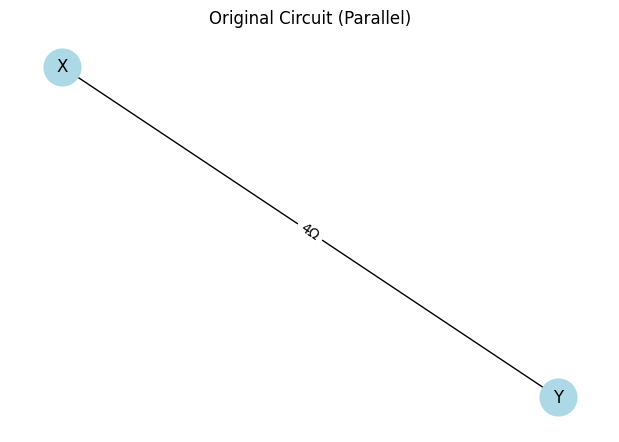
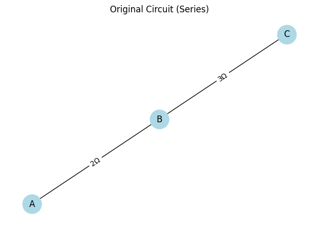
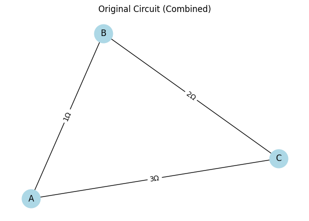

# Problem 1
# Option 1
# Option 1: Simplified Task – Algorithm Description

## Algorithm for Calculating the Equivalent Resistance Using Graph Theory

The algorithm to calculate the equivalent resistance of a circuit using graph theory simplifies the circuit by identifying and reducing series and parallel connections iteratively. The goal is to reduce the graph until a single equivalent resistance is obtained. 

### Steps for the Algorithm:

1. **Graph Representation**:
   - Represent the circuit as a graph, where nodes (vertices) are junctions, and edges represent resistors with weights equal to their resistance values.

2. **Series and Parallel Connection Identification**:
   - **Series Connection**: If two resistors are connected end-to-end (series), their resistances simply add up:
   
   $$
   R_{eq} = R_1 + R_2
   $$

   - **Parallel Connection**: If two resistors are connected in parallel, the equivalent resistance is given by: 
   
   $$
   \frac{1}{R_{eq}} = \frac{1}{R_1} + \frac{1}{R_2}
   $$

   

   

   

3. **Iterative Simplification**:
   - Perform a depth-first search (DFS) or another traversal method to detect series and parallel combinations.
   - Once identified, replace the detected series or parallel components with their equivalent resistance.
   - Update the graph by removing the old components and adding the new equivalent resistance as a single edge.

4. **Handling Nested Combinations**:
   - After each simplification step, check the resulting graph for further series or parallel combinations.
   - Repeat the process until the graph is reduced to a single equivalent resistance.

### Example Circuit Representation

Let's assume we have the following circuit with resistors:

- $R_1 = 10 \ \Omega$
- $R_2 = 20 \ \Omega$
- $R_3 = 30 \ \Omega$
- $R_4 = 40 \ \Omega$

This circuit is represented as a graph where each node is a junction, and each edge is a resistor with a given resistance value.

```plaintext
Node 1 --- R1 --- Node 2 --- R2 --- Node 3
                             |
                             R3
                             |
                           Node 4 --- R4


### 1. **Graph Representation**

The circuit is represented as a graph where each resistor is an edge, and each junction (node) represents a connection between resistors. The weight of each edge is the resistance value of the corresponding resistor.

For example, a simple series circuit with two resistors $R_1$ and $R_2$ connected end-to-end can be represented as:

```plaintext
Node 1 --- R1 --- Node 2 --- R2 --- Node 3
```

### 2. Identifying Series and Parallel Connections

The algorithm identifies series and parallel combinations and simplifies them to an equivalent resistor.

#### Series Connection:
Two resistors $R_1$ and $R_2$ connected in series have an equivalent resistance $R_{\text{eq}}$ given by:

$$
R_{\text{eq}} = R_1 + R_2
$$

For $n$ resistors $R_1$, $R_2$, ..., $R_n$ in series:

$$
R_{\text{eq}} = R_1 + R_2 + \dots + R_n
$$

#### Parallel Connection:
Two resistors $R_1$ and $R_2$ connected in parallel have an equivalent resistance $R_{\text{eq}}$ given by:

$$
\frac{1}{R_{\text{eq}}} = \frac{1}{R_1} + \frac{1}{R_2}
$$

For $n$ resistors $R_1$, $R_2$, ..., $R_n$ in parallel:

$$
\frac{1}{R_{\text{eq}}} = \sum_{i=1}^{n} \frac{1}{R_i}
$$

### 3. Iterative Simplification

- **Step 1**: Identify all series and parallel resistor combinations.
- **Step 2**: For each series or parallel combination, calculate the equivalent resistance using the formulas above.
- **Step 3**: Replace the simplified series or parallel combination with a new resistor that has the equivalent resistance.
- **Step 4**: Remove the original resistors from the graph and update it with the new equivalent resistor.
- **Step 5**: Repeat steps 1-4 until only one resistor remains.

### 4. Handling Nested Series and Parallel Combinations

For complex circuits, you may encounter nested series and parallel combinations. The algorithm will continue simplifying the graph by detecting and reducing these combinations until only one equivalent resistor remains.

For example, consider a combination of resistors:

1. Resistor $R_1$ is in series with resistor $R_2$.
2. The combination of $R_1$ and $R_2$ is in parallel with $R_3$.

The steps to simplify this circuit would be:

1. Simplify $R_1$ and $R_2$ in series:

   $$
   R_{\text{eq, series}} = R_1 + R_2
   $$

2. Then, simplify the equivalent resistance from step 1 with $R_3$ in parallel:

   $$
   \frac{1}{R_{\text{eq, final}}} = \frac{1}{R_{\text{eq, series}}} + \frac{1}{R_3}
   $$

### Example:

Consider the following circuit with three resistors $R_1 = 10 \ \Omega$, $R_2 = 20 \ \Omega$, and $R_3 = 30 \ \Omega$:

1. $R_1$ and $R_2$ are in series.
2. The combination of $R_1$ and $R_2$ is in parallel with $R_3$.

#### Step 1: Simplify $R_1$ and $R_2$ in series:

$$
R_{\text{eq, series}} = R_1 + R_2 = 10 + 20 = 30 \ \Omega
$$

#### Step 2: Simplify the equivalent resistance with $R_3$ in parallel:

$$
\frac{1}{R_{\text{eq, final}}} = \frac{1}{30} + \frac{1}{30} = \frac{2}{30}
$$

$$
R_{\text{eq, final}} = 15 \ \Omega
$$

### 5. Output the Equivalent Resistance

After reducing the graph to a single edge, the remaining resistance is the equivalent resistance of the entire circuit.

### Formula Recap:

1. **Series Resistors**:
   $$ R_{\text{eq}} = R_1 + R_2 + \dots + R_n $$

2. **Parallel Resistors**:
   $$ \frac{1}{R_{\text{eq}}} = \frac{1}{R_1} + \frac{1}{R_2} + \dots + \frac{1}{R_n} $$

3. **Ohm's Law**:
   $$ V = I \cdot R $$

4. **Power**:
   $$ P = V \cdot I $$

   Or using Ohm's law:
   $$ P = I^2 \cdot R $$

   Or:
   $$ P = \frac{V^2}{R} $$