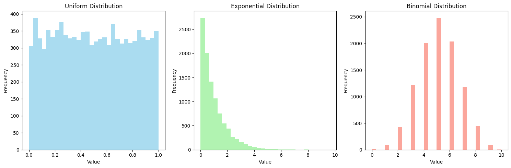
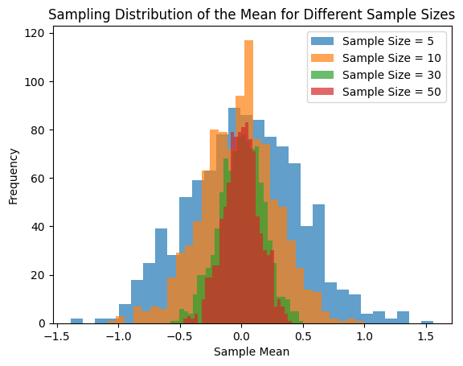
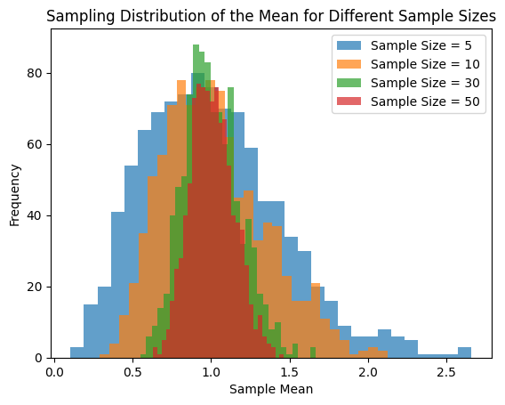
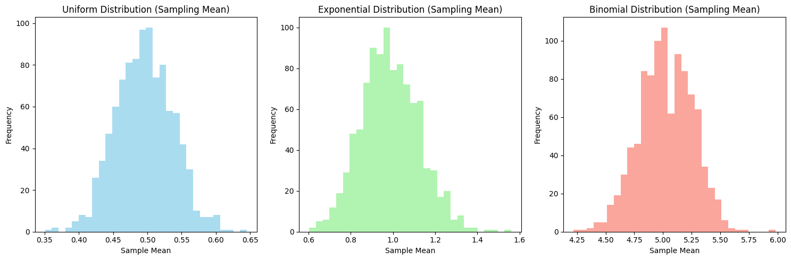

# Problem 1

# Task 1: Simulating Sampling Distributions

## Population Distributions

Select several types of population distributions, such as:

- Uniform distribution
- Exponential distribution
- Binomial distribution

For each distribution, generate a large dataset representing the population.

### Formulas:

1. **Uniform Distribution**:  
   The uniform distribution has the following probability density function (PDF):  
   $$ f(x) = \frac{1}{b - a}, \quad a \leq x \leq b $$  
   where $a$ and $b$ are the minimum and maximum values of the distribution, respectively.

2. **Exponential Distribution**:  
   The exponential distribution has the following PDF:  
   $$ f(x) = \lambda e^{-\lambda x}, \quad x \geq 0 $$  
   where $\lambda$ is the rate parameter, which is the inverse of the mean.

3. **Binomial Distribution**:  
   The binomial distribution has the following probability mass function (PMF):  
   $$ P(X = k) = \binom{n}{k} p^k (1-p)^{n-k} $$  
   where $n$ is the number of trials, $k$ is the number of successes, and $p$ is the probability of success in a single trial.

   

# Task 2: Sampling and Visualization

## Sampling Data

Randomly sample data from the population and calculate the sample mean for different sample sizes, such as 5, 10, 30, and 50.

- **Sample Mean**: The sample mean is given by the formula:  
  $$ \bar{x} = \frac{1}{n} \sum_{i=1}^{n} x_i $$  
  where $\bar{x}$ is the sample mean, $n$ is the sample size, and $x_i$ are the individual sample points.

Repeat the process multiple times (e.g., 1000 iterations) to create a sampling distribution of the sample mean.

### Visualization

- Plot histograms of the sample means for each sample size (5, 10, 30, 50).
- Observe how the histograms converge to a normal distribution as the sample size increases, illustrating the Central Limit Theorem (CLT).

# Task 3: Parameter Exploration

## Investigating the Effect of Population Distribution and Sample Size

Explore how the shape of the original population distribution and the sample size influence the rate of convergence to normality.

### Key Considerations:
- **Population Distribution**: Investigate how different population distributions (Uniform, Exponential, Binomial) affect the convergence to normality in the sampling distribution.
- **Sample Size**: Observe how increasing the sample size impacts the sampling distribution of the sample mean. Larger sample sizes generally lead to a faster convergence to a normal distribution, according to the Central Limit Theorem (CLT).

### Formula for Variance of the Sampling Distribution:
The variance of the sample mean is given by:  
$$ \sigma_{\bar{x}}^2 = \frac{\sigma^2}{n} $$  
where $\sigma_{\bar{x}}^2$ is the variance of the sample mean, $\sigma^2$ is the variance of the original population, and $n$ is the sample size.

### Impact of Population Variance:
- **Population Variance ($\sigma^2$)**: The spread of the sampling distribution is affected by the population's variance. A larger population variance results in a wider sampling distribution.
- **Sampling Distribution Variance**: As the sample size increases, the variance of the sampling distribution decreases (this is due to the $\frac{\sigma^2}{n}$ relationship).

### Visualization:
- **Step 1**: Generate histograms for different sample sizes (e.g., 5, 10, 30, 50) for each population distribution. 
- **Step 2**: For each sample size, repeat the sampling process 1000 times to build the sampling distribution of the sample mean.
- **Step 3**: Plot the histograms to observe the convergence to normality.
- **Step 4**: Compare how the population's variance affects the spread of the sampling distribution.
- **Step 5**: Use Python libraries such as Matplotlib to generate the histograms for each scenario.

# Task 4: Practical Applications

## Formula:

The Central Limit Theorem (CLT) tells us that the sampling distribution of the sample mean will approximate a normal distribution as the sample size increases, even if the population distribution is not normal.

The formula for the sampling distribution of the sample mean is:

$$ \mu_{\bar{x}} = \mu $$  
$$ \sigma_{\bar{x}} = \frac{\sigma}{\sqrt{n}} $$

Where:
- $\mu_{\bar{x}}$ is the mean of the sampling distribution of the sample mean, which equals the population mean $\mu$.
- $\sigma_{\bar{x}}$ is the standard deviation of the sampling distribution of the sample mean, which is the population standard deviation $\sigma$ divided by the square root of the sample size $n$.

