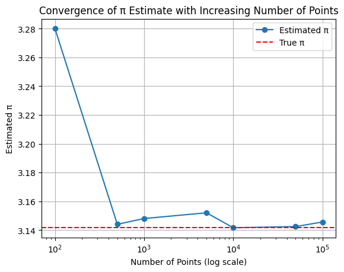
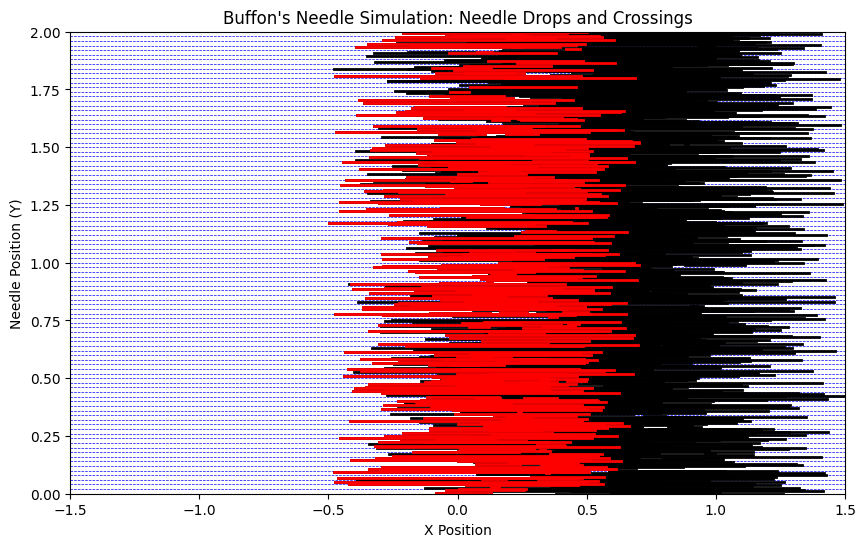

# Problem 2

# Task 1: Estimating π using Monte Carlo Method - Circle-Based Approach

## Explanation:

To estimate $\pi$ using Monte Carlo simulations, we can take advantage of the geometric properties of a circle inscribed inside a square. The idea is to generate random points within the square and determine how many of those points fall inside the circle.

Consider a unit circle, where the radius $r = 1$. The circle is inscribed in a square that has side length 2, so the area of the square is $A_{\text{square}} = 2 \times 2 = 4$, and the area of the circle is $A_{\text{circle}} = \pi \times r^2 = \pi$.

### Geometric Probability:

Let us randomly generate points $(x, y)$ where both $x$ and $y$ are uniformly distributed between $-1$ and $1$. For a point to be inside the unit circle, the condition is:
$$ x^2 + y^2 \leq 1 $$

The ratio of the number of points inside the circle ($N_{\text{circle}}$) to the total number of points ($N_{\text{total}}$) will approximate the ratio of the area of the circle to the area of the square:
$$ \frac{N_{\text{circle}}}{N_{\text{total}}} \approx \frac{A_{\text{circle}}}{A_{\text{square}}} = \frac{\pi}{4} $$

Thus, we can estimate $\pi$ by rearranging the formula:
$$ \pi \approx 4 \cdot \frac{N_{\text{circle}}}{N_{\text{total}}} $$

### Steps:
1. Generate random points $(x, y)$ in the square with coordinates between $-1$ and $1$.
2. Check if each point satisfies the condition $x^2 + y^2 \leq 1$ to determine if it lies inside the circle.
3. Calculate the ratio of points inside the circle to the total points and multiply by 4 to estimate $\pi$.

## Formula Summary:
$$ \pi \approx 4 \cdot \frac{N_{\text{circle}}}{N_{\text{total}}} $$

# Task 2: Simulation - Estimating π through Monte Carlo Method

## Simulation:

In this task, we will simulate the estimation of $\pi$ by generating random points in a 2D square bounding a unit circle. We will count how many of these points fall inside the circle and use that ratio to estimate the value of $\pi$.

### Steps:
1. **Generate random points**: Create random points $(x, y)$ uniformly distributed within the square with coordinates between $-1$ and $1$ for both $x$ and $y$.
2. **Check if the point is inside the unit circle**: The condition for a point to be inside the unit circle is:
   $$ x^2 + y^2 \leq 1 $$  
   If the point satisfies this condition, it lies inside the circle.
3. **Estimate $\pi$**: The ratio of the points inside the circle to the total points will approximate the ratio of the areas of the circle and square:
   $$ \pi \approx 4 \cdot \frac{N_{\text{circle}}}{N_{\text{total}}} $$

   Explanation of the Code:
Random Points: We generate num_points random points with $x$ and $y$ values uniformly distributed between $-1$ and $1$.

Check for Points Inside the Circle: We use the condition $x^2 + y^2 \leq 1$ to check if a point lies inside the unit circle.

Estimate π: We calculate the ratio of points inside the circle to the total number of points, and multiply by 4 to estimate $\pi$.

Explanation of the Plot:
Blue Points: These are the points that fall inside the unit circle.

Red Points: These are the points that fall outside the unit circle.

The plot visually demonstrates how the points are distributed within the square and the circle, illustrating the Monte Carlo method for estimating $\pi$.

# Task 3: Visualization - Plotting Randomly Generated Points

## Visualization:

In this task, we will visualize the results of the Monte Carlo simulation by plotting the randomly generated points. We will distinguish the points that fall inside the unit circle from those that fall outside, and display the plot.

Explanation of the Code:
Random Points: We generate random points $(x, y)$ within the square that has side lengths of 2, with both $x$ and $y$ values between $-1$ and $1$.

Inside the Circle: The condition $x^2 + y^2 \leq 1$ is used to check if the point lies inside the unit circle.

Plotting:

Blue Points: These are the points that lie inside the circle.

Red Points: These are the points that lie outside the circle.

The plot is set to have equal aspect ratio to properly show the circle, and a grid is added for clarity.

# Task 4: Analysis - Convergence and Computational Efficiency

## Analysis:

In this task, we will analyze how the accuracy of the estimate for $\pi$ improves as the number of points in the simulation increases. We will also discuss the convergence rate and computational efficiency of the Monte Carlo method.

### Investigating the Accuracy:

As we increase the number of random points used in the Monte Carlo simulation, the estimated value of $\pi$ should converge to the true value. This is because the ratio of points inside the circle to the total number of points will better approximate the ratio of the areas of the circle and the square as the sample size increases.

We can plot the estimated value of $\pi$ for different sample sizes and observe how the estimate improves with more points.

# Part 2: Estimating π Using Buffon's Needle

## Task 1: Theoretical Foundation

### Buffon’s Needle Problem:

Buffon’s Needle is a famous problem in probability theory that allows for the estimation of $\pi$ based on a simple experiment involving a needle and parallel lines on a flat plane. The problem involves throwing a needle of a certain length onto a plane that has parallel lines drawn at a fixed distance apart, and determining how often the needle crosses one of these lines.

### Problem Setup:

1. **Needle Length ($L$)**: The length of the needle is denoted as $L$.
2. **Distance Between Lines ($d$)**: The distance between two adjacent parallel lines is denoted as $d$.
3. **Number of Throws ($N$)**: The number of times the needle is thrown onto the plane is denoted as $N$.
4. **Number of Crossings ($C$)**: The number of times the needle crosses one of the parallel lines is denoted as $C$.

### Derivation of the Formula:

The probability $P$ that the needle will cross a line is given by a known result from geometry and probability:

$$ P = \frac{2L}{\pi d} $$

Where:
- $L$ is the length of the needle.
- $d$ is the distance between the parallel lines.
- $\pi$ is the mathematical constant.

This probability is derived from the geometry of the problem, where we consider the relationship between the angle of the needle and its distance from the nearest line. 

### Estimating π:

We can estimate $\pi$ by rearranging the formula to express it in terms of the known quantities of the experiment:

$$ \pi \approx \frac{2L \cdot N}{d \cdot C} $$

Where:
- $L$ is the length of the needle.
- $N$ is the total number of throws.
- $d$ is the distance between the parallel lines.
- $C$ is the number of times the needle crosses a line.

### Explanation of the Formula:

1. **Needle Length and Distance Between Lines**: The formula shows that $\pi$ depends on the length of the needle $L$ and the distance between the parallel lines $d$.
2. **Number of Throws and Crossings**: The estimate of $\pi$ improves as we increase the number of throws $N$ and crossings $C$. With more throws, the ratio of crossings to throws will converge to the actual probability, which is related to $\pi$.

This formula provides a way to estimate $\pi$ using physical experimentation, and it is one of the earliest known probabilistic methods to do so.

# Part 2: Estimating π Using Buffon's Needle

## Task 2: Simulation

### Simulation of Buffon’s Needle:

In this task, we will simulate the random dropping of a needle on a plane with parallel lines. We will count the number of times the needle crosses one of these lines and use that information to estimate $\pi$ based on the formula derived in Task 1.

### Steps for the Simulation:

1. **Simulate the Needle Drop**: Randomly generate the center position and angle of the needle. 
2. **Check for Line Crossing**: Determine whether the needle crosses any of the parallel lines based on its center position and angle.
3. **Estimate π**: Use the formula:
   $$ \pi \approx \frac{2L \cdot N}{d \cdot C} $$  
   where:
   - $L$ is the length of the needle,
   - $N$ is the total number of throws,
   - $d$ is the distance between the parallel lines,
   - $C$ is the number of needle crossings.

## Task 3: Visualization

### Visualization of Needle Positions Relative to the Lines

In this task, we will visualize the simulation of Buffon’s Needle by plotting the needle positions relative to the parallel lines. We will distinguish between the needles that cross the lines and those that do not.

Explanation of the Code:
Needle Drop Simulation:

We simulate the drop of a needle by randomly selecting an angle $\theta$ between $0$ and $\frac{\pi}{2}$ (since the angle is uniformly distributed in that range).

We also randomly select the distance $x$ from the center of the needle to the nearest line, which is uniformly distributed between $0$ and $\frac{d}{2}$.

Line Crossing Check:

The condition for the needle crossing a line is given by: 
𝑥
≤
𝐿
2
sin
⁡
(
𝜃
)
x≤ 
2
L
​
 sin(θ) If this condition is true, the needle crosses a line.

Estimate π:

After simulating $N$ throws, we count how many times the needle crosses a line (denoted by $C$).

We then use the formula: 
𝜋
≈
2
𝐿
⋅
𝑁
𝑑
⋅
𝐶
π≈ 
d⋅C
2L⋅N
​
  to estimate $\pi$.
