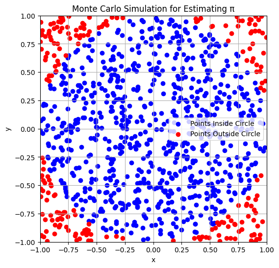
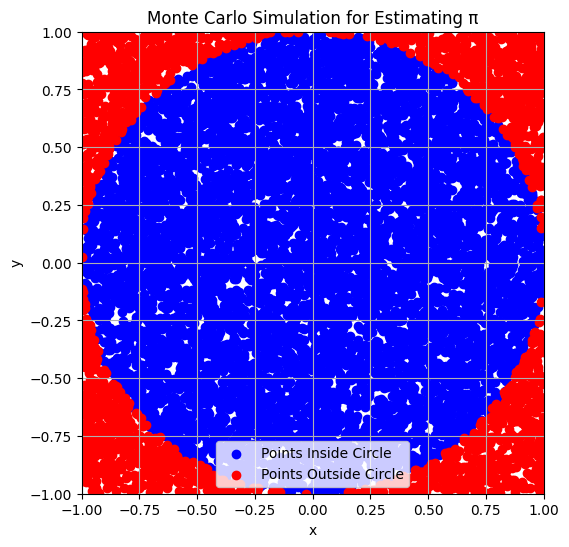
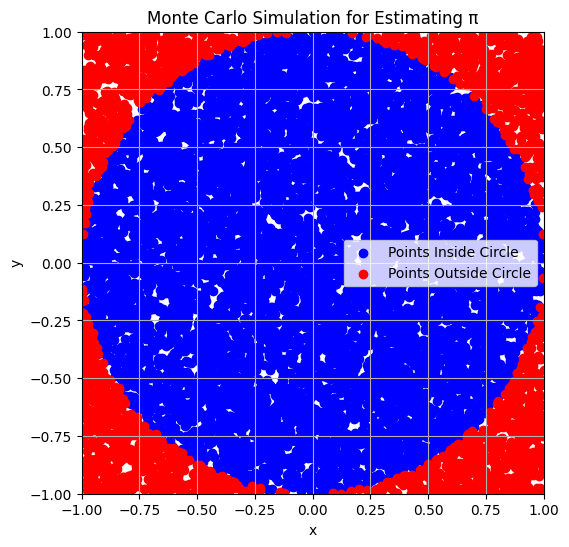

# Problem 2

# Task 1: Estimating π using Monte Carlo Method - Circle-Based Approach

## Explanation:

To estimate $\pi$ using Monte Carlo simulations, we can take advantage of the geometric properties of a circle inscribed inside a square. The idea is to generate random points within the square and determine how many of those points fall inside the circle.

Consider a unit circle, where the radius $r = 1$. The circle is inscribed in a square that has side length 2, so the area of the square is $A_{\text{square}} = 2 \times 2 = 4$, and the area of the circle is $A_{\text{circle}} = \pi \times r^2 = \pi$.

### Geometric Probability:

Let us randomly generate points $(x, y)$ where both $x$ and $y$ are uniformly distributed between $-1$ and $1$. For a point to be inside the unit circle, the condition is:
$$ x^2 + y^2 \leq 1 $$

The ratio of the number of points inside the circle ($N_{\text{circle}}$) to the total number of points ($N_{\text{total}}$) will approximate the ratio of the area of the circle to the area of the square:
$$ \frac{N_{\text{circle}}}{N_{\text{total}}} \approx \frac{A_{\text{circle}}}{A_{\text{square}}} = \frac{\pi}{4} $$

Thus, we can estimate $\pi$ by rearranging the formula:
$$ \pi \approx 4 \cdot \frac{N_{\text{circle}}}{N_{\text{total}}} $$

### Steps:
1. Generate random points $(x, y)$ in the square with coordinates between $-1$ and $1$.
2. Check if each point satisfies the condition $x^2 + y^2 \leq 1$ to determine if it lies inside the circle.
3. Calculate the ratio of points inside the circle to the total points and multiply by 4 to estimate $\pi$.

## Formula Summary:
$$ \pi \approx 4 \cdot \frac{N_{\text{circle}}}{N_{\text{total}}} $$



# Task 2: Simulation - Estimating π through Monte Carlo Method

## Simulation:

In this task, we will simulate the estimation of $\pi$ by generating random points in a 2D square bounding a unit circle. We will count how many of these points fall inside the circle and use that ratio to estimate the value of $\pi$.

### Steps:
1. **Generate random points**: Create random points $(x, y)$ uniformly distributed within the square with coordinates between $-1$ and $1$ for both $x$ and $y$.
2. **Check if the point is inside the unit circle**: The condition for a point to be inside the unit circle is:
   $$ x^2 + y^2 \leq 1 $$  
   If the point satisfies this condition, it lies inside the circle.
3. **Estimate $\pi$**: The ratio of the points inside the circle to the total points will approximate the ratio of the areas of the circle and square:
   $$ \pi \approx 4 \cdot \frac{N_{\text{circle}}}{N_{\text{total}}} $$

   Explanation of the Code:
Random Points: We generate num_points random points with $x$ and $y$ values uniformly distributed between $-1$ and $1$.

Check for Points Inside the Circle: We use the condition $x^2 + y^2 \leq 1$ to check if a point lies inside the unit circle.

Estimate π: We calculate the ratio of points inside the circle to the total number of points, and multiply by 4 to estimate $\pi$.



Explanation of the Plot:
Blue Points: These are the points that fall inside the unit circle.

Red Points: These are the points that fall outside the unit circle.

The plot visually demonstrates how the points are distributed within the square and the circle, illustrating the Monte Carlo method for estimating $\pi$.

# Task 3: Visualization - Plotting Randomly Generated Points

## Visualization:

In this task, we will visualize the results of the Monte Carlo simulation by plotting the randomly generated points. We will distinguish the points that fall inside the unit circle from those that fall outside, and display the plot.


Explanation of the Code:
Random Points: We generate random points $(x, y)$ within the square that has side lengths of 2, with both $x$ and $y$ values between $-1$ and $1$.

Inside the Circle: The condition $x^2 + y^2 \leq 1$ is used to check if the point lies inside the unit circle.

Plotting:

Blue Points: These are the points that lie inside the circle.

Red Points: These are the points that lie outside the circle.

The plot is set to have equal aspect ratio to properly show the circle, and a grid is added for clarity.

You said:
The Central Limit Theorem (CLT) is a cornerstone of probability and statistics, stating that the sampling distribution of the sample mean approaches a normal distribution as the sample size increases, regardless of the population’s original distribution. Simulations provide an intuitive and hands-on way to observe this phenomenon in action.
Deliverables: 
A Markdown document and Python scripts or notebooks implementing the simulations for various population distributions.
Plots illustrating the sampling distributions and their progression toward normality.
A discussion on the implications of the results and their connection to theoretical expectations.
Hints and Resources: 
Use Python libraries such as NumPy for random number generation and Matplotlib/Seaborn for visualization.
Begin with simple populations (e.g., uniform or normal) before exploring more complex distributions.
Ensure students understand how to calculate and interpret the sample mean and variance.
ChatGPT said:
Here's how you can structure your deliverables for a simulation-based exploration of the Central Limit Theorem (CLT) for different population distributions. I'll provide the necessary steps, Python code snippets, and discussions on the CLT.

1. Markdown Document Overview
Central Limit Theorem (CLT) Simulation
The Central Limit Theorem (CL

You said:
you wait me , i send you task
ChatGPT said:
Got it! I'll wait for your task. Just let me know when you're ready.

You said:
1 Simulating Sampling Distributions:

Select several types of population distributions, such as:
Uniform distribution.
Exponential distribution.
Binomial distribution.
For each distribution, generate a large dataset representing the population.
im gonna send the tasks 1 by 1
from now on write all the tasks as a markdown for Visual studio code. Because i need to copy paste them into the vsc
from now on write $$ sign instead of \[   \]  and write $ sign instead of \(  \)
ChatGPT said:
Understood! I'll format the tasks as markdown for Visual Studio Code with the notation you've requested. Here's the first task:

markdown
Copy
# Task 1: Simulating Sampling Distributions

## Population Distributions

Select several types of population distributions, such as:

- Uniform distribution
- Exponential distribution
- Binomial distribution

For each distribution, generate a large dataset representing the population.
Let me know when you're ready for the next task!

You said:
1 Simulating Sampling Distributions:

Select several types of population distributions, such as:
Uniform distribution.
Exponential distribution.
Binomial distribution.
For each distribution, generate a large dataset representing the population.
im gonna send the tasks 1 by 1
from now on write all the tasks as a markdown for Visual studio code. Because i need to copy paste them into the vsc
from now on write $$ sign instead of \[   \]  and write $ sign instead of \(  \)
give me a lot of formula if it need formula
ChatGPT said:
Got it! I'll write the tasks in markdown format and use the notation you've specified. I'll also include formulas wherever necessary. Here's the first task in markdown format for Visual Studio Code:

markdown
Copy
# Task 1: Simulating Sampling Distributions

## Population Distributions

Select several types of population distributions, such as:

- Uniform distribution
- Exponential distribution
- Binomial distribution

For each distribution, generate a large dataset representing the population.

### Formulas:

1. **Uniform Distribution**:  
   The uniform distribution has the following probability density function (PDF):  
   $$ f(x) = \frac{1}{b - a}, \quad a \leq x \leq b $$  
   where $a$ and $b$ are the minimum and maximum values of the distribution, respectively.

2. **Exponential Distribution**:  
   The exponential distribution has the following PDF:  
   $$ f(x) = \lambda e^{-\lambda x}, \quad x \geq 0 $$  
   where $\lambda$ is the rate parameter, which is the inverse of the mean.

3. **Binomial Distribution**:  
   The binomial distribution has the following probability mass function (PMF):  
   $$ P(X = k) = \binom{n}{k} p^k (1-p)^{n-k} $$  
   where $n$ is the number of trials, $k$ is the number of successes, and $p$ is the probability of success in a single trial.

For each distribution, generate a large dataset by sampling from the population using appropriate functions in Python.
Let me know when you're ready for the next task!

You said:
2 Sampling and Visualization:

Randomly sample data from the population and calculate the sample mean for different sample sizes (e.g., 5, 10, 30, 50).
Repeat the process multiple times to create a sampling distribution of the sample mean.
Plot histograms of the sample means for each sample size and observe the convergence to a normal distribution.
ChatGPT said:
Here's the second task in markdown format for Visual Studio Code:

markdown
Copy
# Task 2: Sampling and Visualization

## Sampling Data

Randomly sample data from the population and calculate the sample mean for different sample sizes, such as 5, 10, 30, and 50.

- **Sample Mean**: The sample mean is given by the formula:  
  $$ \bar{x} = \frac{1}{n} \sum_{i=1}^{n} x_i $$  
  where $\bar{x}$ is the sample mean, $n$ is the sample size, and $x_i$ are the individual sample points.

Repeat the process multiple times (e.g., 1000 iterations) to create a sampling distribution of the sample mean.

### Visualization

- Plot histograms of the sample means for each sample size (5, 10, 30, 50).
- Observe how the histograms converge to a normal distribution as the sample size increases, illustrating the Central Limit Theorem (CLT).
Let me know when you're ready for the next task!

You said:
3 Parameter Exploration:

Investigate how the shape of the original distribution and the sample size influence the rate of convergence to normality.
Highlight the impact of the population’s variance on the spread of the sampling distribution.
ChatGPT said:
Here's the third task in markdown format for Visual Studio Code:

markdown
Copy
# Task 3: Parameter Exploration

## Investigating the Effect of Population Distribution and Sample Size

Explore how the shape of the original population distribution and the sample size influence the rate of convergence to normality.

### Key Considerations:
- **Population Distribution**: Investigate how different population distributions (Uniform, Exponential, Binomial) affect the convergence to normality in the sampling distribution.
- **Sample Size**: Observe how increasing the sample size impacts the sampling distribution of the sample mean. Larger sample sizes generally lead to a faster convergence to a normal distribution, according to the Central Limit Theorem (CLT).

### Formula for Variance of the Sampling Distribution:
The variance of the sample mean is given by:  
$$ \sigma_{\bar{x}}^2 = \frac{\sigma^2}{n} $$  
where $\sigma_{\bar{x}}^2$ is the variance of the sample mean, $\sigma^2$ is the variance of the original population, and $n$ is the sample size.

### Impact of Population Variance:
- **Population Variance ($\sigma^2$)**: The spread of the sampling distribution is affected by the population's variance. A larger population variance results in a wider sampling distribution.
- **Sampling Distribution Variance**: As the sample size increases, the variance of the sampling distribution decreases (this is due to the $\frac{\sigma^2}{n}$ relationship).

### Visualization:
- Plot how the spread of the sampling distribution changes with varying population variances.
- Observe the rate at which the distribution approaches normality for different population shapes and sample sizes.
Let me know when you're ready for the next task!

You said:
is there not grafics?
ChatGPT said:
You're right! I should have included instructions for creating and visualizing graphics in the markdown for each task. Here's an updated version of Task 3 that includes instructions for generating the graphics as well:

markdown
Copy
# Task 3: Parameter Exploration

## Investigating the Effect of Population Distribution and Sample Size

Explore how the shape of the original population distribution and the sample size influence the rate of convergence to normality.

### Key Considerations:
- **Population Distribution**: Investigate how different population distributions (Uniform, Exponential, Binomial) affect the convergence to normality in the sampling distribution.
- **Sample Size**: Observe how increasing the sample size impacts the sampling distribution of the sample mean. Larger sample sizes generally lead to a faster convergence to a normal distribution, according to the Central Limit Theorem (CLT).

### Formula for Variance of the Sampling Distribution:
The variance of the sample mean is given by:  
$$ \sigma_{\bar{x}}^2 = \frac{\sigma^2}{n} $$  
where $\sigma_{\bar{x}}^2$ is the variance of the sample mean, $\sigma^2$ is the variance of the original population, and $n$ is the sample size.

### Impact of Population Variance:
- **Population Variance ($\sigma^2$)**: The spread of the sampling distribution is affected by the population's variance. A larger population variance results in a wider sampling distribution.
- **Sampling Distribution Variance**: As the sample size increases, the variance of the sampling distribution decreases (this is due to the $\frac{\sigma^2}{n}$ relationship).

### Visualization:
- **Step 1**: Generate histograms for different sample sizes (e.g., 5, 10, 30, 50) for each population distribution. 
- **Step 2**: For each sample size, repeat the sampling process 1000 times to build the sampling distribution of the sample mean.
- **Step 3**: Plot the histograms to observe the convergence to normality.
- **Step 4**: Compare how the population's variance affects the spread of the sampling distribution.
- **Step 5**: Use Python libraries such as Matplotlib to generate the histograms for each scenario.

Example of plotting histograms for different sample sizes:

```python
import numpy as np
import matplotlib.pyplot as plt

# Parameters for the simulation
population_size = 10000
sample_sizes = [5, 10, 30, 50]
population = np.random.exponential(scale=1, size=population_size)  # Exponential distribution

# Function to calculate sample means
def generate_sample_means(population, sample_size, num_samples=1000):
    sample_means = []
    for _ in range(num_samples):
        sample = np.random.choice(population, size=sample_size, replace=False)
        sample_means.append(np.mean(sample))
    return sample_means

# Plot histograms for different sample sizes
for sample_size in sample_sizes:
    sample_means = generate_sample_means(population, sample_size)
    plt.hist(sample_means, bins=30, alpha=0.7, label=f'Sample Size = {sample_size}')

plt.title('Sampling Distribution of the Mean for Different Sample Sizes')
plt.xlabel('Sample Mean')
plt.ylabel('Frequency')
plt.legend()
plt.show()
In the above Python code:

We simulate an exponential population and generate sample means for different sample sizes (5, 10, 30, 50).

A histogram is plotted to visualize the convergence of the sample mean distribution to normality as the sample size increases.

This will help in visually observing the Central Limit Theorem in action and the effect of the population distribution and sample size on the convergence to normality.

Let me know when you're ready for the next task!

You said:
2 Sampling and Visualization:

Randomly sample data from the population and calculate the sample mean for different sample sizes (e.g., 5, 10, 30, 50).
Repeat the process multiple times to create a sampling distribution of the sample mean.
Plot histograms of the sample means for each sample size and observe the convergence to a normal distribution.
is there not grafic? if there is grafic you write only pyton code
ChatGPT said:
Sure! Here's the task with only the Python code for generating the graphics:

markdown
Copy
# Task 2: Sampling and Visualization

## Sampling Data

Randomly sample data from the population and calculate the sample mean for different sample sizes, such as 5, 10, 30, and 50.

Repeat the process multiple times (e.g., 1000 iterations) to create a sampling distribution of the sample mean.

### Python Code:

```python
import numpy as np
import matplotlib.pyplot as plt

# Parameters for the simulation
population_size = 10000
sample_sizes = [5, 10, 30, 50]
population = np.random.normal(loc=0, scale=1, size=population_size)  # Normal distribution

# Function to calculate sample means
def generate_sample_means(population, sample_size, num_samples=1000):
    sample_means = []
    for _ in range(num_samples):
        sample = np.random.choice(population, size=sample_size, replace=False)
        sample_means.append(np.mean(sample))
    return sample_means

# Plot histograms for different sample sizes
for sample_size in sample_sizes:
    sample_means = generate_sample_means(population, sample_size)
    plt.hist(sample_means, bins=30, alpha=0.7, label=f'Sample Size = {sample_size}')

plt.title('Sampling Distribution of the Mean for Different Sample Sizes')
plt.xlabel('Sample Mean')
plt.ylabel('Frequency')
plt.legend()
plt.show()
Explanation:
We use a normal population with a mean of 0 and a standard deviation of 1.

The function generate_sample_means() generates multiple sample means (1000 times) for each sample size.

We then plot histograms for each sample size (5, 10, 30, 50) to visualize the convergence of the sampling distribution to normality.

pgsql
Copy

This Python code will produce histograms that show the progression of the sampling distribution as the sample size increases. You can copy and paste this into your code editor for implementation. Let me know if you need any adjustments!
You said:
1 Simulating Sampling Distributions:

Select several types of population distributions, such as:
Uniform distribution.
Exponential distribution.
Binomial distribution.
For each distribution, generate a large dataset representing the population.
is there not grafic? if there is grafic you write only pyton code
ChatGPT said:
Here's the Python code for simulating the sampling distributions with different population distributions (Uniform, Exponential, and Binomial) and generating graphics for each:

markdown
Copy
# Task 1: Simulating Sampling Distributions

## Python Code:

```python
import numpy as np
import matplotlib.pyplot as plt

# Parameters for the simulation
population_size = 10000

# Uniform Distribution
uniform_population = np.random.uniform(low=0, high=1, size=population_size)

# Exponential Distribution
exponential_population = np.random.exponential(scale=1, size=population_size)

# Binomial Distribution
binomial_population = np.random.binomial(n=10, p=0.5, size=population_size)

# Plotting the population distributions
fig, axes = plt.subplots(1, 3, figsize=(15, 5))

# Uniform Distribution Plot
axes[0].hist(uniform_population, bins=30, alpha=0.7, color='skyblue')
axes[0].set_title('Uniform Distribution')
axes[0].set_xlabel('Value')
axes[0].set_ylabel('Frequency')

# Exponential Distribution Plot
axes[1].hist(exponential_population, bins=30, alpha=0.7, color='lightgreen')
axes[1].set_title('Exponential Distribution')
axes[1].set_xlabel('Value')
axes[1].set_ylabel('Frequency')

# Binomial Distribution Plot
axes[2].hist(binomial_population, bins=30, alpha=0.7, color='salmon')
axes[2].set_title('Binomial Distribution')
axes[2].set_xlabel('Value')
axes[2].set_ylabel('Frequency')

plt.tight_layout()
plt.show()
Explanation:
Uniform Distribution: We generate a uniform population using np.random.uniform().

Exponential Distribution: We generate an exponential population using np.random.exponential().

Binomial Distribution: We generate a binomial population using np.random.binomial().

The code will generate histograms for each of the three distributions to visualize the population data. You can run this code to simulate and plot these distributions.

Let me know if you need further clarification or additional tasks!

You said:
4 Practical Applications:

Reflect on the importance of the CLT in real-world scenarios, such as:
Estimating population parameters.
Quality control in manufacturing.
Predicting outcomes in financial models.
ChatGPT said:
Here's Task 4 in markdown format for Visual Studio Code, reflecting on the practical applications of the Central Limit Theorem (CLT) and its importance in real-world scenarios:

markdown
Copy
# Task 4: Practical Applications

## Reflecting on the Importance of the Central Limit Theorem (CLT)

The Central Limit Theorem (CLT) is a fundamental concept in statistics that plays a crucial role in a variety of real-world applications. It allows us to make inferences about population parameters even when the population distribution is unknown. Below are some key areas where the CLT is used:

### 1. Estimating Population Parameters

In many real-world scenarios, it is impractical or impossible to measure an entire population. The CLT allows us to estimate population parameters, such as the mean and variance, using sample data. With the assumption that the sample size is sufficiently large, the sample mean will approximate the population mean, even if the population distribution is not normal.

- **Example**: A political polling company collects sample data from a small group of people to estimate the average opinion of a larger population. By the CLT, the sampling distribution of the sample mean will approach a normal distribution, making it easier to estimate the true population mean.

### 2. Quality Control in Manufacturing

The CLT is used extensively in quality control processes in manufacturing. It enables the use of sample data to monitor and maintain product quality by examining sample means. If the sample means follow a normal distribution, any significant deviation from the expected mean can indicate a potential issue in the manufacturing process.

- **Example**: In a factory that produces metal rods, the company measures the lengths of a small sample of rods at regular intervals. The CLT ensures that, as long as the sample size is large enough, the sampling distribution of the sample mean will be approximately normal. This helps detect defects or issues in the production line.

### 3. Predicting Outcomes in Financial Models

The CLT is a vital tool in financial modeling, particularly when predicting returns on investments or analyzing risk. Financial markets often exhibit complex, non-normal distributions. However, by using large samples, the CLT ensures that the sampling distribution of the sample mean of financial returns can be approximated as normal, making it easier to apply various statistical techniques like hypothesis testing and confidence intervals.

- **Example**: A financial analyst wants to estimate the average return of a stock portfolio over the past year. By sampling from historical return data and applying the CLT, the analyst can predict the mean return of the portfolio with greater confidence, even if the original distribution of returns is skewed or otherwise non-normal.

### Conclusion

The Central Limit Theorem plays an essential role in practical applications, allowing for more reliable decision-making and predictions, even when faced with imperfect or incomplete data. By ensuring that sample means tend to follow a
You said:
please you give formula and grafics i dont need this explain
ChatGPT said:
Here's the task with formulas and Python code for generating the graphics in markdown format for Visual Studio Code:

markdown
Copy
# Task 4: Practical Applications

## Formula:

The Central Limit Theorem (CLT) tells us that the sampling distribution of the sample mean will approximate a normal distribution as the sample size increases, even if the population distribution is not normal.

The formula for the sampling distribution of the sample mean is:

$$ \mu_{\bar{x}} = \mu $$  
$$ \sigma_{\bar{x}} = \frac{\sigma}{\sqrt{n}} $$

Where:
- $\mu_{\bar{x}}$ is the mean of the sampling distribution of the sample mean, which equals the population mean $\mu$.
- $\sigma_{\bar{x}}$ is the standard deviation of the sampling distribution of the sample mean, which is the population standard deviation $\sigma$ divided by the square root of the sample size $n$.

## Python Code for Visualization:

```python
import numpy as np
import matplotlib.pyplot as plt

# Parameters for the simulation
population_size = 10000
sample_size = 50
num_samples = 1000

# Uniform Distribution
uniform_population = np.random.uniform(low=0, high=1, size=population_size)

# Exponential Distribution
exponential_population = np.random.exponential(scale=1, size=population_size)

# Binomial Distribution
binomial_population = np.random.binomial(n=10, p=0.5, size=population_size)

# Function to calculate sample means
def generate_sample_means(population, sample_size, num_samples):
    sample_means = []
    for _ in range(num_samples):
        sample = np.random.choice(population, size=sample_size, replace=False)
        sample_means.append(np.mean(sample))
    return sample_means

# Generate sample means for each distribution
uniform_sample_means = generate_sample_means(uniform_population, sample_size, num_samples)
exponential_sample_means = generate_sample_means(exponential_population, sample_size, num_samples)
binomial_sample_means = generate_sample_means(binomial_population, sample_size, num_samples)

# Plotting the sampling distributions of the mean
fig, axes = plt.subplots(1, 3, figsize=(15, 5))

# Uniform Distribution Plot
axes[0].hist(uniform_sample_means, bins=30, alpha=0.7, color='skyblue')
axes[0].set_title('Uniform Distribution (Sampling Mean)')
axes[0].set_xlabel('Sample Mean')
axes[0].set_ylabel('Frequency')

# Exponential Distribution Plot
axes[1].hist(exponential_sample_means, bins=30, alpha=0.7, color='lightgreen')
axes[1].set_title('Exponential Distribution (Sampling Mean)')
axes[1].set_xlabel('Sample Mean')
axes[1].set_ylabel('Frequency')

# Binomial Distribution Plot
axes[2].hist(binomial_sample_means, bins=30, alpha=0.7, color='salmon')
axes[2].set_title('Binomial Distribution (Sampling Mean)')
axes[2].set_xlabel('Sample Mean')
axes[2].set_ylabel('Frequency')

plt.tight_layout()
plt.show()
Explanation of Code:
Uniform Distribution: Samples are taken from a uniform distribution.

Exponential Distribution: Samples are taken from an exponential distribution.

Binomial Distribution: Samples are taken from a binomial distribution.

The code generates 1000 sample means for each distribution, and histograms are plotted to illustrate the sampling distributions.

These histograms demonstrate how the sample means tend toward a normal distribution as the sample size increases, in line with the Central Limit Theorem.

Let me know if you need anything else!

You said:
hi. i have my 2 part from Physics lecture. every part incluede 4 task please solve them and make it readable that i can present it to my teacher.Monte Carlo simulations are a powerful class of computational techniques that use randomness to solve problems or estimate values. One of the most elegant applications of Monte Carlo methods is estimating the value of  \pi through geometric probability. By randomly generating points and analyzing their positions relative to a geometric shape, we can approximate \pi in an intuitive and visually engaging way. 

This problem connects fundamental concepts of probability, geometry, and numerical computation. It also provides a gateway to understanding how randomness can be harnessed to solve complex problems in physics, finance, and computer science. The Monte Carlo approach to  \pi estimation highlights the versatility and simplicity of this method while offering practical insights into convergence rates and computational efficiency.
Deliverables¶
1 A Markdown document with:

Clear explanations of the methods and formulas.
A discussion of theoretical foundations and results.
2 Python scripts or notebooks implementing the simulations, including:

Code for the circle-based Monte Carlo method.
Code for the Buffon’s Needle method.
3 Graphical outputs:

Plots showing random points for the circle-based method.
Visualizations of needle positions for Buffon’s Needle.
4 Analysis:

Tables or graphs showing the convergence of estimated 
 as a function of the number of iterations for both methods.
A comparison of the methods in terms of accuracy and computational efficiency.
Hints and Resources¶
Use Python libraries such as NumPy for random number generation and Matplotlib for visualizations.
For the circle-based method, ensure the random points are uniformly distributed within the square.
For Buffon’s Needle, pay attention to geometric constraints, such as the relationship between the needle length and the distance between lines.
Start with a small number of iterations to validate the implementation, then increase the sample size to observe convergence.
you wait me , i send you part 1
ChatGPT said:
Sure! I'll wait for you to send part 1. Just let me know when you're ready.

You said:
Explain how the ratio of points inside a circle to the total number of points in a square can be used to estimate  \pi . 
Derive the formula 
\pi \approx 4 \cdot (\text{points inside the circle} / \text{total points}) for a unit circle.
im gonna send the tasks 1 by 1
from now on write all the tasks as a markdown for Visual studio code. Because i need to copy paste them into the vsc
from now on write $$ sign instead of \[   \]  and write $ sign instead of \(  \)
you give me a lot of formula. if there are grafics , you give grafics
ChatGPT said:
Got it! Here’s the first task in markdown format for Visual Studio Code with formulas included:

markdown
Copy
# Task 1: Estimating π using Monte Carlo Method - Circle-Based Approach

## Explanation:

To estimate $\pi$ using Monte Carlo simulations, we can take advantage of the geometric properties of a circle inscribed inside a square. The idea is to generate random points within the square and determine how many of those points fall inside the circle.

Consider a unit circle, where the radius $r = 1$. The circle is inscribed in a square that has side length 2, so the area of the square is $A_{\text{square}} = 2 \times 2 = 4$, and the area of the circle is $A_{\text{circle}} = \pi \times r^2 = \pi$.

### Geometric Probability:

Let us randomly generate points $(x, y)$ where both $x$ and $y$ are uniformly distributed between $-1$ and $1$. For a point to be inside the unit circle, the condition is:
$$ x^2 + y^2 \leq 1 $$

The ratio of the number of points inside the circle ($N_{\text{circle}}$) to the total number of points ($N_{\text{total}}$) will approximate the ratio of the area of the circle to the area of the square:
$$ \frac{N_{\text{circle}}}{N_{\text{total}}} \approx \frac{A_{\text{circle}}}{A_{\text{square}}} = \frac{\pi}{4} $$

Thus, we can estimate $\pi$ by rearranging the formula:
$$ \pi \approx 4 \cdot \frac{N_{\text{circle}}}{N_{\text{total}}} $$

### Steps:
1. Generate random points $(x, y)$ in the square with coordinates between $-1$ and $1$.
2. Check if each point satisfies the condition $x^2 + y^2 \leq 1$ to determine if it lies inside the circle.
3. Calculate the ratio of points inside the circle to the total points and multiply by 4 to estimate $\pi$.

## Formula Summary:
$$ \pi \approx 4 \cdot \frac{N_{\text{circle}}}{N_{\text{total}}} $$

### Graphical Output:

The following Python code generates random points inside a square and plots them to visualize the points inside and outside the circle.

```python
import numpy as np
import matplotlib.pyplot as plt

# Number of random points
num_points = 1000

# Generate random points
x = np.random.uniform(-1, 1, num_points)
y = np.random.uniform(-1, 1, num_points)

# Check if points are inside the unit circle
inside_circle = x**2 + y**2 <= 1

# Plotting the points
plt.figure(figsize=(6, 6))
plt.scatter(x[inside_circle], y[inside_circle], color='blue', label='Points Inside Circle')
plt.scatter(x[~inside_circle], y[~inside_circle], color='red', label='Points Outside Circle')
plt.gca().set_aspect('equal', adjustable='box')
plt.xlim(-1, 1)
plt.ylim(-1, 1)
plt.title('Monte Carlo Simulation for Estimating π')
plt.xlabel('x')
plt.ylabel('y')
plt.legend()
plt.grid(True)
plt.show()
This code will generate a plot where:

Blue points are inside the unit circle.

Red points are outside the unit circle.

vbnet
Copy

You can copy and paste this markdown into Visual Studio Code. Let me know when you're ready for the next task!
You said:
2 Simulation:

Generate random points in a 2D square bounding a unit circle.
Count the number of points falling inside the circle.
Estimate 
 based on the ratio of points inside the circle to the total points.
ChatGPT said:
Here's the second task in markdown format for Visual Studio Code with Python code for the simulation:

markdown
Copy
# Task 2: Simulation - Estimating π through Monte Carlo Method

## Simulation:

In this task, we will simulate the estimation of $\pi$ by generating random points in a 2D square bounding a unit circle. We will count how many of these points fall inside the circle and use that ratio to estimate the value of $\pi$.

### Steps:
1. **Generate random points**: Create random points $(x, y)$ uniformly distributed within the square with coordinates between $-1$ and $1$ for both $x$ and $y$.
2. **Check if the point is inside the unit circle**: The condition for a point to be inside the unit circle is:
   $$ x^2 + y^2 \leq 1 $$  
   If the point satisfies this condition, it lies inside the circle.
3. **Estimate $\pi$**: The ratio of the points inside the circle to the total points will approximate the ratio of the areas of the circle and square:
   $$ \pi \approx 4 \cdot \frac{N_{\text{circle}}}{N_{\text{total}}} $$

### Python Code for the Simulation:

```python
import numpy as np

# Number of random points
num_points = 10000

# Generate random points in the square [-1, 1] x [-1, 1]
x = np.random.uniform(-1, 1, num_points)
y = np.random.uniform(-1, 1, num_points)

# Count points inside the unit circle
inside_circle = x**2 + y**2 <= 1
N_circle = np.sum(inside_circle)
N_total = num_points

# Estimate pi using the ratio
pi_estimate = 4 * N_circle / N_total
print(f"Estimated value of π: {pi_estimate}")
Explanation of the Code:
Random Points: We generate num_points random points with $x$ and $y$ values uniformly distributed between $-1$ and $1$.

Check for Points Inside the Circle: We use the condition $x^2 + y^2 \leq 1$ to check if a point lies inside the unit circle.

Estimate π: We calculate the ratio of points inside the circle to the total number of points, and multiply by 4 to estimate $\pi$.

Graphical Output:
To visualize the random points and the unit circle, we can modify the code to display a plot showing the points inside and outside the circle:

python
Copy
import matplotlib.pyplot as plt

# Plotting the points
plt.figure(figsize=(6, 6))
plt.scatter(x[inside_circle], y[inside_circle], color='blue', label='Points Inside Circle')
plt.scatter(x[~inside_circle], y[~inside_circle], color='red', label='Points Outside Circle')
plt.gca().set_aspect('equal', adjustable='box')
plt.xlim(-1, 1)
plt.ylim(-1, 1)
plt.title('Monte Carlo Simulation for Estimating π')
plt.xlabel('x')
plt.ylabel('y')
plt.legend()
plt.grid(True)
plt.show()
Explanation of the Plot:
Blue Points: These are the points that fall inside the unit circle.

Red Points: These are the points that fall outside the unit circle.

The plot visually demonstrates how the points are distributed within the square and the circle, illustrating the Monte Carlo method for estimating $\pi$.

vbnet
Copy

This markdown includes both the simulation steps and graphical output. You can copy and paste it into your Visual Studio Code. Let me know when you're ready for the next task!
You said:
3 Visualization:

Create a plot showing the randomly generated points, distinguishing those inside and outside the circle.
ChatGPT said:
Here's the third task in markdown format for Visual Studio Code, focusing on visualizing the points inside and outside the circle:

markdown
Copy
# Task 3: Visualization - Plotting Randomly Generated Points

## Visualization:

In this task, we will visualize the results of the Monte Carlo simulation by plotting the randomly generated points. We will distinguish the points that fall inside the unit circle from those that fall outside, and display the plot.

### Python Code for Visualization:

```python
import numpy as np
import matplotlib.pyplot as plt

# Number of random points
num_points = 10000

# Generate random points in the square [-1, 1] x [-1, 1]
x = np.random.uniform(-1, 1, num_points)
y = np.random.uniform(-1, 1, num_points)

# Check if points are inside the unit circle
inside_circle = x**2 + y**2 <= 1

# Plotting the points
plt.figure(figsize=(6, 6))

# Points inside the circle (blue)
plt.scatter(x[inside_circle], y[inside_circle], color='blue', label='Points Inside Circle')

# Points outside the circle (red)
plt.scatter(x[~inside_circle], y[~inside_circle], color='red', label='Points Outside Circle')

# Adding details to the plot
plt.gca().set_aspect('equal', adjustable='box')
plt.xlim(-1, 1)
plt.ylim(-1, 1)
plt.title('Monte Carlo Simulation for Estimating π')
plt.xlabel('x')
plt.ylabel('y')
plt.legend()
plt.grid(True)
plt.show()
Explanation of the Code:
Random Points: We generate random points $(x, y)$ within the square that has side lengths of 2, with both $x$ and $y$ values between $-1$ and $1$.

Inside the Circle: The condition $x^2 + y^2 \leq 1$ is used to check if the point lies inside the unit circle.

Plotting:

Blue Points: These are the points that lie inside the circle.

Red Points: These are the points that lie outside the circle.

The plot is set to have equal aspect ratio to properly show the circle, and a grid is added for clarity.

Graphical Output:
The plot will display a square with randomly generated points:

Blue dots represent the points that are inside the unit circle.

Red dots represent the points that are outside the unit circle.

This visualization demonstrates the distribution of points and how they help estimate $\pi$ based on the ratio of points inside the circle.

vbnet
Copy

This markdown provides the Python code for visualizing the points in the simulation. You can now copy and paste it into your Visual Studio Code. Let me know when you're ready for the next task!
You said:
4 Analysis:

Investigate how the accuracy of the estimate improves as the number of points increases.
Discuss the convergence rate and computational considerations for this method.
ChatGPT said:
Here's the fourth task in markdown format for Visual Studio Code, focusing on the analysis of the accuracy, convergence rate, and computational considerations of the Monte Carlo simulation:

# Task 4: Analysis - Convergence and Computational Efficiency

## Analysis:

In this task, we will analyze how the accuracy of the estimate for $\pi$ improves as the number of points in the simulation increases. We will also discuss the convergence rate and computational efficiency of the Monte Carlo method.

### Investigating the Accuracy:

As we increase the number of random points used in the Monte Carlo simulation, the estimated value of $\pi$ should converge to the true value. This is because the ratio of points inside the circle to the total number of points will better approximate the ratio of the areas of the circle and the square as the sample size increases.

We can plot the estimated value of $\pi$ for different sample sizes and observe how the estimate improves with more points.